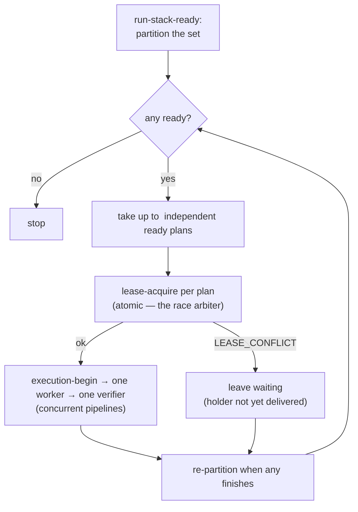

# Concurrent run-stack — overlapping provably-independent plans

This concern continues from [design.md](./design.md). Its finding is short and
strong: **the safety is already fully built; the change is a coordinator policy.**

## The safety already exists (no new invariant)

Two v0.6 invariants already specify everything overlap needs:

- **INV-CONCURRENCY-01** defines an atomic (repository, path-region) path lease
  recorded under `.runtime/locks/paths/`, with exact overlap semantics (equal,
  prefix-ancestor, or repository-wide `.`), the descendant exemption, and the
  outcome for a competitor: a read-only or blocked result, never a silently stolen
  lease. The lease is held from execution start until **delivery**, not merely
  verification.
- **INV-CONCURRENCY-02** already builds each plan's base before its worker starts
  (anchor tip, single predecessor branch, or a runtime-authored integration merge)
  and rebuilds a stale base when a predecessor is repaired.

So two plans that touch disjoint path regions can already run at the same time
safely, and two that overlap already cannot. **This scope introduces no new
invariant.** It only asks the coordinator to stop serializing when the substrate
already permits overlap.

## The gap is one default

`run-stack-ready` already partitions the set into `verified` / `ready` /
`waiting` / `failed` / `blocked` / `refused`, and the run-stack loop already says
a coordinator "may start several when they are provably independent." But it then
recommends the simplest path — "run one at a time in id order" — and the
coordinator obeys. A stack of N independent plans therefore takes ~N× the time it
needs to.

The change: among the `ready` bucket, launch the independent set as **concurrent
worker → verifier pipelines**, bounded by a fan-out width, then re-partition when
any finishes.

## The lease is the arbiter — races are safe

Readiness is evaluated at partition time, so two plans that both look `ready`
could in principle target overlapping paths. This is safe without any extra
coordination: step-3a `lease-acquire` is an **atomic exclusive-create**
(INV-CONCURRENCY-01). Whichever plan acquires first proceeds; the other receives
`LEASE_CONFLICT` and drops to `waiting`, to become ready when the holder is
delivered. The coordinator therefore does **not** need to prove disjointness
before launching — a naive "attempt to lease all ready" is already correct. Proving
independence up front is an optimization that avoids wasted `execution-begin`
work, not a safety requirement.

## Fan-out width is coordinator policy, not an invariant

How many pipelines to run at once is a tunable coordinator decision, deliberately
**not** promoted to an invariant:

- Start conservative (2–3). The ceiling is host concurrency and the coordinator's
  own ability to track several pipelines, not a contract limit.
- Width 1 is exactly today's serial behavior — the compatibility floor.
- The measurement scope ([measurement.md](./measurement.md)) supplies the wall-clock
  span that says whether a wider fan-out actually pays or whether coordination
  overhead eats it on small stacks.

## The real price is coordination and reporting, not correctness

Because correctness is free, the cost lives entirely in the coordinator:

- **Record hygiene.** Each pipeline owns its own execution directory and records
  (`worker-commit-record`, `verifier-result-record`); the coordinator must keep N
  in-flight executions from cross-contaminating. Runtime records are atomic and
  per-execution (INV-RUNTIME-02), which contains the blast radius.
- **Plain-language reporting gets harder.** Serial progress reads as a clean
  sequence; concurrent progress interleaves ("one plan built, another checking").
  The doc-01 / `docs/terminology.md` rules still hold — report by effect, never
  expose branches or worktrees — so the coordinator narrates interleaved *effects*,
  not mechanism.
- **Partial failure is already defined.** A failed or blocked plan holds only its
  descendants (run-stack loop; INV-CONCURRENCY-01 descendant semantics), so a
  concurrent sibling failing does not poison independent peers. Preservation
  (INV-PRESERVE-01) keeps every in-flight pipeline's evidence.

## Boundaries

- Only run-stack overlaps plans; a single `cc-execute` is still exactly one worker
  in dependency order (INV-EXEC-02 / INV-OWN-01). Concurrency is **across** plans,
  never **inside** one.
- The loop still owns leases (it acquires before `execution-begin`, which must not
  acquire its own), and holds them until delivery.
- Nothing here marks a plan done or delivered; run-stack adds no authority.
