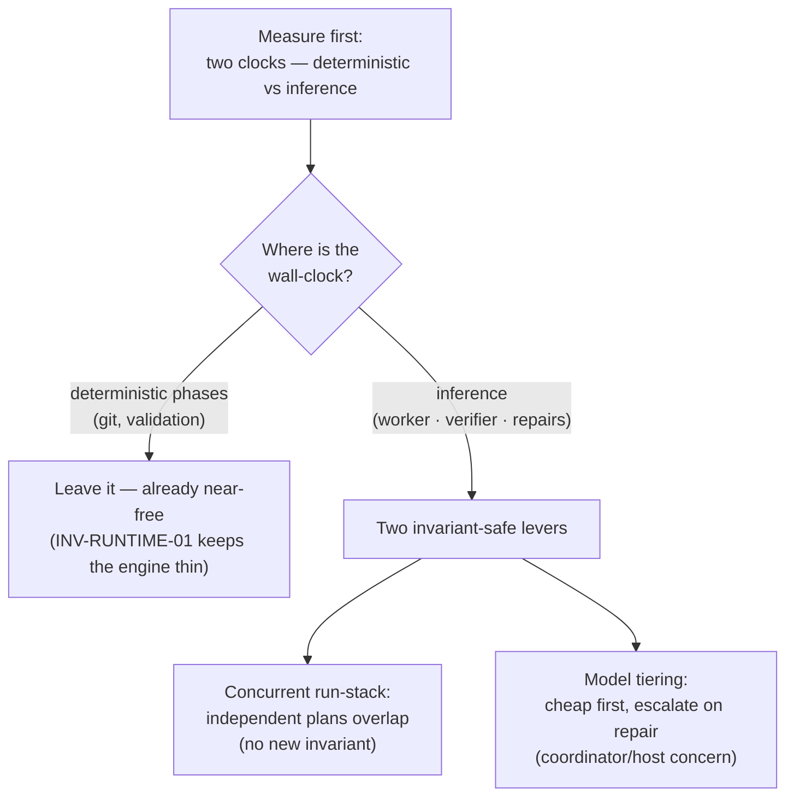

# Context Circuit v0.7.0 — Execution Latency (overview)

Status: authoritative source design for the v0.7.0 execution-latency scope (delta
on v0.6 / v0.6.1)
Revision: 1 — 2026-08-29

This is the **overview** of the execution-latency scope: the capability, the
principles, the central decision, and the shape of the solution. Each mechanism
has its own detail file (see [Detailed design](#detailed-design)). Read
[README.md](./README.md) first for the index, and
[../../v0.5/core/design.md](../../v0.5/core/design.md) for everything this delta
builds on.

## The one capability

Make Context Circuit **actions finish sooner** without changing what they mean.
Every guarantee — one worker per execution, one independent verifier, human-gated
completion, separate delivery — is preserved exactly. This scope only removes
avoidable wall-clock: work that waits when it could run in parallel, and heavy
inference spent where a smaller model or lower effort would pass.

The starting position is healthy: current execution is already acceptable. This
is a "faster where we safely can" pass, not a rescue. So the first move is to
**measure**, and only then to spend effort where the measurement says it lives.

## Problem

An "action" in Context Circuit is built from two layers that are orders of
magnitude apart in cost, and it is easy to optimize the wrong one:

1. **The deterministic layer — the runtime library.** Each runtime action is one
   `sh wrapper/runtime/engine.sh <action>`: POSIX shell dispatch plus git
   plumbing (`rev-parse`, `worktree add`, `merge`, `rebase`). It is sub-second to
   low-single-digit-seconds, dominated by worktree/merge work in base
   preparation. INV-RUNTIME-01 deliberately keeps it thin. Micro-tuning it polishes
   the part that is already fast.
2. **The inference layer — coordinator, worker, verifier turns.** A single
   execution is coordinator reasoning → **one worker** (long: reads repo guidance,
   implements every task, commits) → **one independent verifier** (long) →
   possibly a **repair loop** (worker + verifier again, up to three attempts under
   INV-REPAIR-01). This is where essentially all wall-clock lives.

Three specific losses hide in the inference layer:

- **Independent plans run one at a time.** A run-stack of plans that touch
  disjoint paths executes serially even though the concurrency machinery to run
  them together already exists and is already proven safe.
- **Every agent runs at the same model regardless of the work.** A bounded rename
  and a subtle cross-repo change pay the same inference cost, though only one needs
  it, and the user has no per-role say.
- **Nothing is measured.** There is no per-phase or per-attempt timing, so any
  "it's faster now" claim is a feeling, not evidence, and there is no signal to
  aim optimization at.

## Goals

1. Attribute wall-clock to a **layer and a phase** with lightweight, additive
   instrumentation, and make "faster" provable in the acceptance suite.
2. Let **provably-independent plans in a run-stack overlap**, bounded by a
   coordinator fan-out width, with zero change to the ownership or independence
   contract.
3. Let the user set **model and effort per role** in concrete, host-local config,
   and optionally **escalate on repair**, so heavy inference is spent only where
   the work — or the user — asks for it.
4. Keep every core guarantee intact: one writer per execution, one independent
   verifier reading committed state, the three-failure limit, human-gated
   completion, separate delivery, `host-blocked` honesty.

## Non-goals

- **No parallelism inside a single execution.** One worker per plan, in
  dependency order, is INV-EXEC-02 + INV-OWN-01 — a guarantee, not an
  inefficiency. This scope never spawns a second concurrent writer for one plan.
- **No verifier weakened for speed.** Independence is role separation and
  read-only inspection of committed state (INV-VERIFY-01/02), never a function of
  model. A verifier on a smaller model is still a separate, independent agent, or
  it is not done.
- **No model or timing intelligence in the runtime.** INV-RUNTIME-01 forbids
  model prompts and provider launch code in the engine; tier selection lives with
  the coordinator/host. The engine only records deterministic durations it can
  already observe.
- **No new authority.** Speed knobs never gate a route, role, lease,
  verification, or completion (INV-HOST-01).
- **No bash micro-tuning as a headline.** Reducing forks in the engine is a real
  but marginal cleanup; it is out of scope as a latency lever.

## Principles (carried and added)

v0.7.0 keeps all v0.5/v0.6 principles and adds three:

- **Measure the layer before you optimize it.** Wall-clock is attributed to a
  clock (deterministic vs inference) and a phase before any effort is spent; the
  near-free layer is left alone on purpose.
- **Speed is spent on inference, never bought from safety.** Every latency win
  comes from parallelizing already-independent work or from spending fewer /
  cheaper inference tokens — never from collapsing a role, skipping a verify, or
  loosening a lease.
- **Concurrency is a coordinator policy over an already-safe substrate.** The
  atomic lock and path lease (INV-OWN-01 / INV-CONCURRENCY-01) already make
  overlap safe; how many plans to overlap is a tunable coordinator decision, not
  a new invariant.

## The central decision — latency is an inference-layer problem, and the safe levers already exist

The instinct on "make it faster" is to tune the code that runs — the engine. That
is the wrong layer, and the contract already says so:

- The **runtime is deliberately thin and near-free** (INV-RUNTIME-01). Its git
  work is deterministic and small; it is not where the seconds go.
- The seconds go to **inference**, and the two safe ways to reduce it are already
  latent in the design:
  - **Overlap independent plans.** INV-CONCURRENCY-01 already defines an atomic
    (repository, path-region) lease with exact overlap and descendant semantics,
    and INV-CONCURRENCY-02 already builds each plan's base. Running independent
    plans together introduces **no new invariant** — the only thing missing is the
    coordinator choosing to fan out instead of defaulting to id-order serial. The
    lease is the arbiter, so even a naive "launch all ready" is safe: a loser gets
    a `LEASE_CONFLICT` and drops to `waiting`.
  - **Set model and effort per role.** Model and effort are bounded,
    non-authoritative host evidence (INV-HOST-01) and must not live in the engine
    (INV-RUNTIME-01). So they are a coordinator/host decision that changes cost and
    speed, never meaning: a concrete per-role `(model, effort)` in a host-local
    config, with an `escalate_on_repair` toggle that composes with the existing
    failure counter (INV-REPAIR-01) — raise above the configured start on repair,
    never touch what a rejection costs.

Both levers are specializations of the existing execution spine, not bypasses.
Full arguments in [concurrent-run-stack.md](./concurrent-run-stack.md) and
[model-tiering.md](./model-tiering.md); the measurement that justifies aiming at
them is in [measurement.md](./measurement.md).

## What changes relative to v0.6

| Area | v0.6 | v0.7.0 |
| --- | --- | --- |
| Timing evidence | none | additive **per-phase / per-attempt** durations in the execution record, plus coordinator-observed **inference wall-clock** |
| Run-stack cadence | independent plans run **serially** in id order | coordinator **fans out** provably-independent ready plans, bounded by a fan-out width; the lease arbitrates races |
| Model / effort | uniform per agent | **concrete per-role `(model, effort)`** in a host-local config (adapter defaults fill unset roles), with per-role `escalate_on_repair`; optional per-plan complexity hint |
| Where speed knobs live | n/a | coordinator/host only; the **runtime stays model-free and thin** (INV-RUNTIME-01) |
| Contract delta | n/a | **no new invariant for concurrency** (INV-CONCURRENCY-01/02 already govern); additive schema fields; coordinator policy notes |

Everything else in v0.6 is unchanged.

## Detailed design

- [measurement.md](./measurement.md) — the two-observer model (deterministic
  durations the engine stamps vs inference wall-clock only the coordinator can
  see), the additive record fields, and the acceptance assertions that make
  "faster" provable.
- [concurrent-run-stack.md](./concurrent-run-stack.md) — why the safety is already
  built (INV-CONCURRENCY-01/02), the coordinator fan-out over the ready bucket,
  the lease as race arbiter, fan-out width as policy, and the coordination /
  reporting cost that is the real price.
- [model-tiering.md](./model-tiering.md) — model/effort as a coordinator/host
  concern (INV-RUNTIME-01, INV-HOST-01), the **concrete per-role `(model, effort)`
  host-local config** with adapter defaults, per-role `escalate_on_repair`
  composing with INV-REPAIR-01 without changing accounting, the optional per-plan
  complexity hint, and how verifier independence is preserved.

## Compatibility (summary)

Backward compatible and opt-in at every step. With instrumentation added but the
levers off, behavior is byte-for-byte v0.6 plus extra recorded fields. A run-stack
with a fan-out width of one is exactly today's serial behavior. A host that
exposes only one model tier runs everything at that tier. The additive execution
and plan fields default to absent and are ignored by v0.6 readers. Contract detail
in each concern file.

## Implementation order

Bounded, independently reviewable phases, each updating the semantic fixtures that
prove it. Measurement is first on purpose — it de-risks and sizes the other two:

1. **Measurement** — additive per-phase / per-attempt durations in the execution
   record; the coordinator records observed worker/verifier wall-clock and attempt
   count; acceptance asserts the fields exist and are monotonic. No behavior
   change.
2. **Per-role model/effort** — coordinator spawns worker and verifier at their
   configured concrete `(model, effort)` from the host-local config (adapter
   defaults where unset), and on repair raises above the start when
   `escalate_on_repair` is true. The values used are recorded as host evidence; the
   failure counter (INV-REPAIR-01) is untouched. Adds the host-local per-role
   config and the optional per-plan `complexity`.
3. **Concurrent run-stack (width-gated)** — the run-stack loop fans out
   provably-independent ready plans up to a configured width; the lease arbitrates
   races; partial failure holds only descendants, exactly as today. No new
   invariant.
4. **Semantic verification** — a run-stack trace showing two independent plans
   overlapping and a conflicting pair serializing via `LEASE_CONFLICT`; a repair
   trace showing tier escalation without changing the failure count; timing fields
   asserted present.

This design does not authorize implementation, delivery, or publication by itself.

## Final design decisions

- v0.7.0 is a delta on v0.6; all v0.6 decisions remain in force unless superseded.
- **Latency is an inference-layer problem.** The deterministic runtime is left
  thin and near-free (INV-RUNTIME-01); it is not a latency lever.
- **Measure before optimizing.** Additive per-phase / per-attempt durations plus
  coordinator-observed inference wall-clock; timing is evidence only and never a
  gate.
- **Concurrent run-stack adds no new invariant.** INV-CONCURRENCY-01/02 already
  make independent-plan overlap safe; the change is a bounded coordinator fan-out
  policy, with the path lease as the race arbiter.
- **Model/effort is a coordinator/host concern, invariant-neutral.** It is bounded
  host evidence (INV-HOST-01), never in the engine (INV-RUNTIME-01), and never
  authorizes anything.
- **The config is concrete, per-role, and host-local.** The user names real
  `(model, effort)` values for `worker` and `verifier` (the coordinator is the
  session they already control) in a host-local file — non-portable, in the
  `.claude/` category, with adapter-shipped defaults for unset roles. No abstract
  tier vocabulary and no per-host mapping table.
- **`escalate_on_repair` is per role.** `true` makes the configured `(model,
  effort)` a start-and-floor that repairs may raise (the adapter owns the ladder
  above it), composing with INV-REPAIR-01 without changing the failure counter;
  `false` is a hard pin respected even at the third failure, with its cost reported
  honestly. Picking the same model for worker and verifier does not break
  independence (role + read-only, not model — INV-VERIFY-01/02).
- **No parallelism inside one execution and no weakened verifier.** One worker per
  plan in dependency order (INV-EXEC-02 / INV-OWN-01); independence is role and
  read-only, not model class (INV-VERIFY-01/02).
- Provisional `runtime_version` `0.7.0`; this scope proposes **no new INV id** —
  its concurrency safety is existing INV-CONCURRENCY-01/02 and its tiering safety
  is existing INV-HOST-01 / INV-RUNTIME-01. Additive schema fields and their
  integers settle in `wrapper/contracts/` on acceptance.
