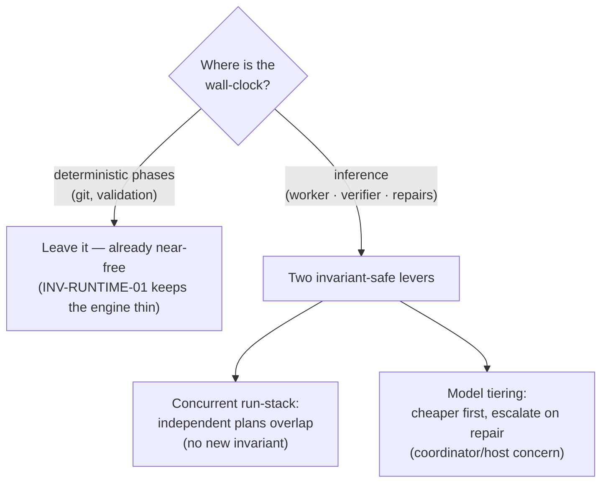

# Context Circuit v0.7.0 — Execution Latency (overview)

Status: authoritative source design for the v0.7.0 execution-latency scope (delta
on v0.6 / v0.6.1)
Revision: 1 — 2026-08-29

This is the **overview** of the execution-latency scope: the capability, the
principles, the central decision, and the shape of the solution. Each mechanism
has its own detail file (see [Detailed design](#detailed-design)). Read
[README.md](./README.md) first for the index, and
[../../v0.5/core/design.md](../../v0.5/core/design.md) for everything this delta
builds on.

## The one capability

Make Context Circuit **actions finish sooner** without changing what they mean.
Every guarantee — one worker per execution, one independent verifier, human-gated
completion, separate delivery — is preserved exactly. This scope only removes
avoidable wall-clock: work that waits when it could run in parallel, and heavy
inference spent where a smaller model or lower effort would pass.

The starting position is healthy: current execution is already acceptable. This
is a "faster where we safely can" pass, not a rescue. So the first move is to
**measure**, and only then to spend effort where the measurement says it lives.

## Problem

An "action" in Context Circuit is built from two layers that are orders of
magnitude apart in cost, and it is easy to optimize the wrong one:

1. **The deterministic layer — the runtime library.** Each runtime action is one
   `sh wrapper/runtime/engine.sh <action>`: POSIX shell dispatch plus git
   plumbing (`rev-parse`, `worktree add`, `merge`, `rebase`). It is sub-second to
   low-single-digit-seconds, dominated by worktree/merge work in base
   preparation. INV-RUNTIME-01 deliberately keeps it thin. Micro-tuning it polishes
   the part that is already fast.
2. **The inference layer — coordinator, worker, verifier turns.** A single
   execution is coordinator reasoning → **one worker** (long: reads repo guidance,
   implements every task, commits) → **one independent verifier** (long) →
   possibly a **repair loop** (worker + verifier again, up to three attempts under
   INV-REPAIR-01). This is where essentially all wall-clock lives.

Three specific losses hide in the inference layer:

- **Independent plans run one at a time.** A run-stack of plans that touch
  disjoint paths executes serially even though the concurrency machinery to run
  them together already exists and is already proven safe.
- **Every agent runs at the same model regardless of the work.** A bounded rename
  and a subtle cross-repo change pay the same inference cost, though only one needs
  it, and the user has no per-role say.
- **The (model, effort) each role ran at is not recorded.** Without it there is no
  way to tell a first-try pass from a repaired one at a given tier, or to see which
  tier a plan ran. (Timing itself is not missing — an attempt is already bracketed
  by `started_at`/`checked_at`; see [measurement.md](./measurement.md).)

## Goals

1. Record the **`(model, effort)` each role ran at** as bounded, additive host
   evidence — the one fact a timestamp cannot recover — while timing stays the
   attempt's own pre-existing `started_at`/`checked_at` span. No new timing
   machinery.
2. Let **provably-independent plans in a run-stack overlap**, bounded by a
   coordinator fan-out width, with zero change to the ownership or independence
   contract.
3. Let the user set **model and effort per role** in a concrete, host-local,
   host-grouped config, and optionally **escalate on repair**, and have the host
   adapter actually **apply** it on the child spawn, so heavy inference is spent
   only where the work — or the user — asks for it.
4. Keep every core guarantee intact: one writer per execution, one independent
   verifier reading committed state, the three-failure limit, human-gated
   completion, separate delivery, `host-blocked` honesty.

## Non-goals

- **No parallelism inside a single execution.** One worker per plan, in
  dependency order, is INV-EXEC-02 + INV-OWN-01 — a guarantee, not an
  inefficiency. This scope never spawns a second concurrent writer for one plan.
- **No verifier weakened for speed.** Independence is role separation and
  read-only inspection of committed state (INV-VERIFY-01/02), never a function of
  model. A verifier on a smaller model is still a separate, independent agent, or
  it is not done.
- **No model or timing intelligence in the runtime.** INV-RUNTIME-01 forbids
  model prompts and provider launch code in the engine; tier selection lives with
  the coordinator/host. The engine only records deterministic durations it can
  already observe.
- **No new authority.** Speed knobs never gate a route, role, lease,
  verification, or completion (INV-HOST-01).
- **No bash micro-tuning as a headline.** Reducing forks in the engine is a real
  but marginal cleanup; it is out of scope as a latency lever.

## Principles (carried and added)

v0.7.0 keeps all v0.5/v0.6 principles and adds three:

- **Don't instrument a layer you've agreed not to tune.** The deterministic
  runtime is near-free by construction and, under INV-RUNTIME-01, never a target;
  it is left alone on purpose, and it needs no permanent per-phase stopwatch to
  keep re-confirming that. Record only what a plain timestamp cannot recover — the
  `(model, effort)` each role ran at — and read timing from the attempt's own
  `started_at`/`checked_at`.
- **Speed is spent on inference, never bought from safety.** Every latency win
  comes from parallelizing already-independent work or from spending fewer /
  cheaper inference tokens — never from collapsing a role, skipping a verify, or
  loosening a lease.
- **Concurrency is a coordinator policy over an already-safe substrate.** The
  atomic lock and path lease (INV-OWN-01 / INV-CONCURRENCY-01) already make
  overlap safe; how many plans to overlap is a tunable coordinator decision, not
  a new invariant.

## The central decision — latency is an inference-layer problem, and the safe levers already exist

The instinct on "make it faster" is to tune the code that runs — the engine. That
is the wrong layer, and the contract already says so:

- The **runtime is deliberately thin and near-free** (INV-RUNTIME-01). Its git
  work is deterministic and small; it is not where the seconds go.
- The seconds go to **inference**, and the two safe ways to reduce it are already
  latent in the design:
  - **Overlap independent plans.** INV-CONCURRENCY-01 already defines an atomic
    (repository, path-region) lease with exact overlap and descendant semantics,
    and INV-CONCURRENCY-02 already builds each plan's base. Running independent
    plans together introduces **no new invariant** — the only thing missing is the
    coordinator choosing to fan out instead of defaulting to id-order serial. The
    lease is the arbiter, so even a naive "launch all ready" is safe: a loser gets
    a `LEASE_CONFLICT` and drops to `waiting`.
  - **Set model and effort per role.** Model and effort are bounded,
    non-authoritative host evidence (INV-HOST-01) and must not live in the engine
    (INV-RUNTIME-01). So they are a coordinator/host decision that changes cost and
    speed, never meaning: a concrete per-role `(model, effort)` in a host-local
    config, with an `escalate_on_repair` toggle that composes with the existing
    failure counter (INV-REPAIR-01) — raise above the configured start on repair,
    never touch what a rejection costs.

Both levers are specializations of the existing execution spine, not bypasses.
Full arguments in [concurrent-run-stack.md](./concurrent-run-stack.md) and
[model-tiering.md](./model-tiering.md); what an execution records (and what was
tried and cut) is in [measurement.md](./measurement.md).

## What changes relative to v0.6

| Area | v0.6 | v0.7.0 |
| --- | --- | --- |
| Execution evidence | none | additive per-attempt **`(model, effort)`** host evidence; timing is the attempt's own `started_at`/`checked_at` span (no new timing field) |
| Run-stack cadence | independent plans run **serially** in id order | coordinator **fans out** provably-independent ready plans, bounded by a fan-out width; the lease arbitrates races |
| Model / effort | uniform per agent | **concrete per-role `(model, effort)`** in a host-local, **host-grouped** config (adapter defaults fill unset), with per-role `escalate_on_repair`; optional per-plan complexity hint; the host adapter **applies** it on the child spawn |
| Where speed knobs live | n/a | coordinator/host only; the **runtime stays model-free and thin** (INV-RUNTIME-01) |
| Contract delta | n/a | **no new invariant** (INV-CONCURRENCY-01/02 and INV-HOST-01/INV-RUNTIME-01 already govern); additive schema fields; coordinator/host policy notes |

Everything else in v0.6 is unchanged.

## Detailed design

- [measurement.md](./measurement.md) — what an execution actually records (the
  per-role `(model, effort)`), timing from the pre-existing `started_at`/`checked_at`
  span, and the honest account of the phase_ms / coordinator-wall-clock machinery
  that was built and then cut.
- [concurrent-run-stack.md](./concurrent-run-stack.md) — why the safety is already
  built (INV-CONCURRENCY-01/02), the coordinator fan-out over the ready bucket,
  the lease as race arbiter, fan-out width as policy, and the coordination /
  reporting cost that is the real price.
- [model-tiering.md](./model-tiering.md) — model/effort as a coordinator/host
  concern (INV-RUNTIME-01, INV-HOST-01), the **host-local, host-grouped `(model,
  effort)` config** with adapter defaults, that **recording is not running** (the
  adapter applies it on the child spawn; per-child effort may be unavailable),
  per-role `escalate_on_repair` composing with INV-REPAIR-01 without changing
  accounting, the optional per-plan complexity hint, and how verifier independence
  is preserved.

## Compatibility (summary)

Backward compatible and opt-in at every step. With the levers off, behavior is
byte-for-byte v0.6 plus the per-attempt `(model, effort)` evidence record. A
run-stack with a fan-out width of one is exactly today's serial behavior. A host
that exposes only one model runs everything at it. The additive execution and plan
fields default to absent and are ignored by v0.6 readers. Contract detail in each
concern file.

## Implementation order

Bounded, independently reviewable phases, each updating the semantic fixtures that
prove it:

1. **Per-attempt evidence** — the `attempt-evidence-record` action stores the
   `(model, effort)` each role ran at (bounded, credential-free); acceptance asserts
   it is recorded and the surface is bounded. No behavior change, and no new timing
   machinery — timing is the attempt's own `started_at`/`checked_at` span.
2. **Per-role model/effort** — coordinator reads the host's group from the
   host-local config (adapter defaults where unset) and the host adapter **sets the
   model on the worker/verifier spawn**; on repair it raises above the start when
   `escalate_on_repair` is true. The failure counter (INV-REPAIR-01) is untouched.
   Adds the host-grouped config and the optional per-plan `complexity`.
3. **Concurrent run-stack (width-gated)** — the run-stack loop fans out
   provably-independent ready plans up to a configured width; the lease arbitrates
   races; partial failure holds only descendants, exactly as today. No new
   invariant.
4. **Semantic verification** — a run-stack trace showing two independent plans
   overlapping and a conflicting pair serializing via `LEASE_CONFLICT`; a repair
   trace showing the recorded model change without changing the failure count; a
   live case proving the configured model is what actually ran (from the host's
   sub-agent transcript, not the evidence record).

This design does not authorize implementation, delivery, or publication by itself.

## Final design decisions

- v0.7.0 is a delta on v0.6; all v0.6 decisions remain in force unless superseded.
- **Latency is an inference-layer problem.** The deterministic runtime is left
  thin and near-free (INV-RUNTIME-01); it is not a latency lever.
- **Record only what a timestamp cannot recover.** The one additive per-attempt
  record is the `(model, effort)` each role ran at (evidence only, never a gate);
  execution timing is the attempt's own pre-existing `started_at`/`checked_at`
  span. The `phase_ms` map and coordinator-recorded wall-clock from the first cut
  were built and then removed — fragile and redundant, and they measured the
  deterministic layer INV-RUNTIME-01 already forbids optimizing (see
  [measurement.md](./measurement.md)).
- **Concurrent run-stack adds no new invariant.** INV-CONCURRENCY-01/02 already
  make independent-plan overlap safe; the change is a bounded coordinator fan-out
  policy, with the path lease as the race arbiter.
- **Model/effort is a coordinator/host concern, invariant-neutral.** It is bounded
  host evidence (INV-HOST-01), never in the engine (INV-RUNTIME-01), and never
  authorizes anything.
- **The config is concrete, per-role, host-local, and grouped by host.** The user
  names real `(model, effort)` values for `worker` and `verifier` (the coordinator
  is the session they already control) in a gitignored `role-tiering.local.yaml`,
  keyed by `hosts.<id>` so each host names the models available on it, with
  adapter-shipped defaults for unset host or role. No abstract tier vocabulary and
  no per-host mapping table.
- **Recording a tier is not running it.** The host adapter must set the model on
  the child spawn; recording alone leaves the child on the session model. Per-child
  effort may be unavailable on a host, in which case tiering is model-only. On
  trivial tasks the win is cost, not latency.
- **`escalate_on_repair` is per role.** `true` makes the configured `(model,
  effort)` a start-and-floor that repairs may raise (the adapter owns the ladder
  above it), composing with INV-REPAIR-01 without changing the failure counter;
  `false` is a hard pin respected even at the third failure, with its cost reported
  honestly. Picking the same model for worker and verifier does not break
  independence (role + read-only, not model — INV-VERIFY-01/02).
- **No parallelism inside one execution and no weakened verifier.** One worker per
  plan in dependency order (INV-EXEC-02 / INV-OWN-01); independence is role and
  read-only, not model class (INV-VERIFY-01/02).
- Provisional `runtime_version` `0.7.0`; this scope proposes **no new INV id** —
  its concurrency safety is existing INV-CONCURRENCY-01/02 and its tiering safety
  is existing INV-HOST-01 / INV-RUNTIME-01. Additive schema fields and their
  integers settle in `wrapper/contracts/` on acceptance.
