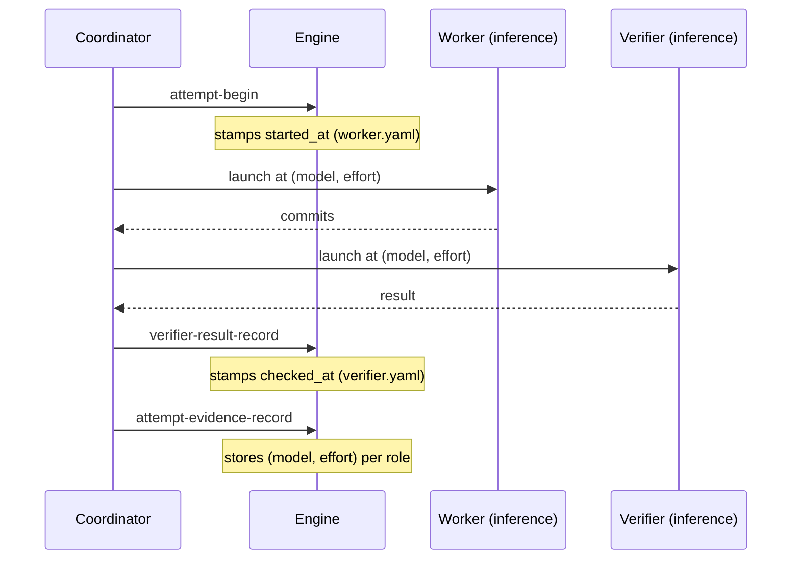

# Measurement — what an execution records, and what it deliberately does not

This concern continues from [design.md](./design.md). The premise held — "measure
the layer before you optimize it" — but building it out showed the honest
measurement is far smaller than the first cut designed. This file states what an
execution actually records, and, just as important, what was tried and cut and
why. It changes no behavior; it is evidence, never a gate (INV-HOST-01).

## Timing is already there — the attempt's own timestamps

An attempt has always been bracketed by two timestamps the engine writes anyway:

- `started_at`, stamped by `attempt-begin` in `attempts/NNN/worker.yaml` — the
  attempt start.
- `checked_at`, stamped by `verifier-result-record` in
  `attempts/NNN/verifier.yaml` — the attempt end.

Their span **is** the attempt's inference wall-clock. It is deterministic, always
present, and needs no coordinator step. This scope adds **no new timing field**:
the duration falls out of timestamps that predate it. When a per-role split
(worker vs verifier) is wanted, the worker's captured commit time divides the
span; and the single most accurate per-role figure lives in the host's own
sub-agent transcript, outside workspace state entirely.

## The one thing worth recording — the (model, effort) each role ran at

The engine is model-blind by construction (INV-RUNTIME-01), so the one fact a
timestamp observer cannot recover after the fact is **which model and effort each
role actually ran at**. That — and only that — is what the coordinator records per
attempt, via the additive `attempt-evidence-record` action, into
`attempts/NNN/host-evidence.yaml`: `worker_model` / `worker_effort` /
`verifier_model` / `verifier_effort`, plus the optional `complexity` and
`escalated` markers. It is bounded, credential-free host evidence (INV-HOST-01 /
INV-SEC-01); no gate, route, lease, verdict, or the worker-failure counter
(INV-REPAIR-01) ever reads it. Read against the failure counter it gives a
first-try-pass-rate.

Recording the model is not the same as *running* at it — the host adapter must set
the model on the child spawn for the tier to take effect
([model-tiering.md](./model-tiering.md)). The evidence is the coordinator's record
of what it selected; the ground truth of what actually ran is the sub-agent
transcript.

## Edge cases

- **Host-blocked verifier.** It records `worker_model` but no `verifier_model`
  (none ran); the missing value, with `status: blocked` and no passed verifier
  record, is the evidence of the block (INV-VERIFY-02 / INV-PRESERVE-01).
- **Concurrent run-stack.** Each execution owns its own record, so per-plan
  timestamps stay clean; a run-level speedup, if wanted, is derived by the
  coordinator from the timestamp span across the overlapping set, never stored in
  one plan's record.

## What was cut, and why (the honest part)

The first cut of this concern specified a **two-observer** model — the engine
stamping a `phase_ms` map (`base_prepare`, `grounding_discovery`,
`integration_merge`, `verifier_prepare`) plus `attempt_started_at`/`_ended_at`,
and the coordinator recording `worker_wall_s`/`verifier_wall_s`. Both were built,
then removed:

- **Coordinator-recorded wall-clock — removed.** It was fragile (the coordinator
  skipped it in practice and had to be pushed to record it), redundant with the
  engine's `started_at`/`checked_at` span, and less accurate than the sub-agent
  transcript. A stopwatch held across an async background wait is the wrong place
  to measure inference.
- **Engine `phase_ms` machinery — removed.** It timed the deterministic runtime
  phases — the layer INV-RUNTIME-01 already keeps thin and the scope's own central
  decision says never to tune. Those phases are a rounding error by construction; a
  permanent per-phase millisecond map (with a portable-clock helper and nested-map
  bookkeeping) is complexity in a runtime meant to be small, re-measuring a layer we
  have agreed not to optimize. The one-time confirmation that the engine is near-free
  did its job; it does not need to run forever.

Net: the engine keeps only the version bump, the `complexity`-hint validation, and
the bounded `attempt-evidence-record` action; timing is the pre-existing attempt
timestamps.

## What acceptance asserts

- a normal execution records `worker_model` and `verifier_model` in the attempt's
  host-evidence;
- the evidence surface is bounded — an unknown key or an unsafe value is refused;
- a host-blocked trace records `worker_model` but not `verifier_model`;
- a repair trace shows the recorded model changing across attempts while the
  worker-failure counter is untouched by that change (escalation is evidence-only).
