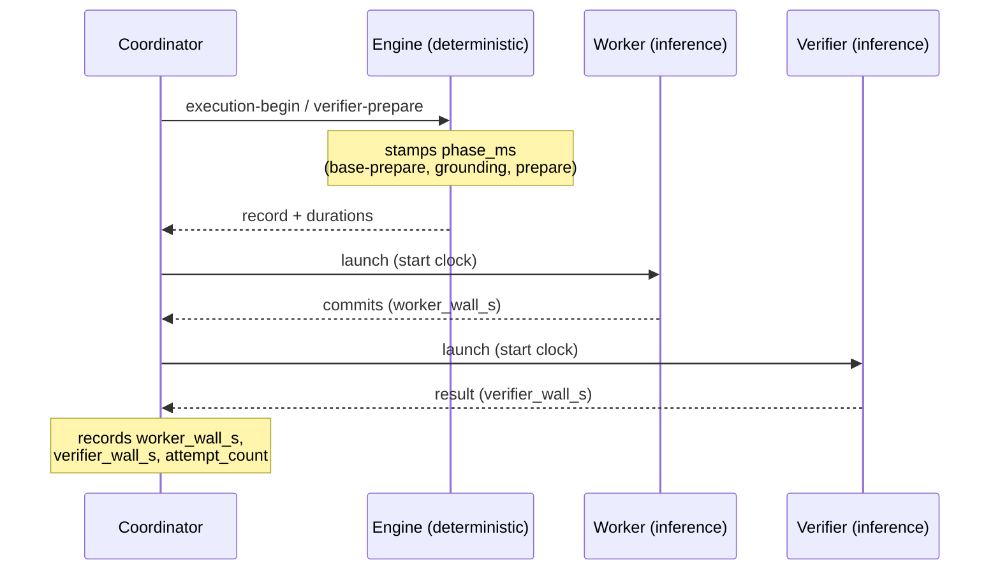

# Measurement — attributing wall-clock to a layer and a phase

This concern continues from [design.md](./design.md) and specifies **how latency
is observed** before any lever is pulled. It changes no behavior; it only makes
the two other mechanisms aimable and provable.

## The two-observer model

Wall-clock lives in two places that no single observer can see at once:

- The **runtime (engine)** can time only **deterministic work it performs
  itself** — base preparation (worktree add, integration merge, rebase), grounding
  discovery, validation, verifier preparation. It cannot see inference: the worker
  and verifier run out of process, in the host, after the engine has returned.
- The **coordinator** is the only observer of **inference wall-clock** — the gap
  between launching a worker or verifier child and receiving its result — because
  it is the thing that launches them. The engine is already back at a shell prompt
  during that entire interval.

So measurement is split by construction: the engine self-stamps deterministic
durations; the coordinator records observed inference durations. Neither is a gate
(INV-HOST-01 in spirit: evidence, not authority), and both are additive.

## What the engine stamps (deterministic)

The engine already has `cc_now()` (ISO-8601 UTC) and already records `created_at`
/ `updated_at` on the execution, `acquired_at` / `released_at` on leases, and
`completed_at` on completion. What is missing is **phase resolution**. Additive to
the execution record (`wrapper/contracts/schemas/execution.yaml`):

- `attempt_started_at` / `attempt_ended_at` per attempt.
- a `phase_ms` map keyed by deterministic phase (`base_prepare`,
  `grounding_discovery`, `verifier_prepare`, `integration_merge`).

These are written atomically with the record they belong to (INV-RUNTIME-02); a
partial timing map never carries meaning. Because they are pure bookkeeping over
work the engine already does, they do not add model prompts or launch logic and
so respect INV-RUNTIME-01.

## What the coordinator records (inference)

The number that actually matters is inference wall-clock. The coordinator, per
attempt, records alongside the runtime's attempt record:

- `worker_wall_s` — launch-to-result for the worker child.
- `verifier_wall_s` — launch-to-result for the independent verifier child.
- `attempt_count` — already implied by INV-REPAIR-01's counter; surfaced here as a
  first-class timing dimension because each attempt is a full worker + verifier
  round trip.

The coordinator observes these as host facts; it never lets them influence a
route, gate, or verdict. They are the raw material for judging whether a lever
paid off.

## Edge cases

- **Blocked executions still record what ran.** A `host-blocked` verifier
  (INV-VERIFY-02) records the deterministic phases and `worker_wall_s` up to the
  block; the missing `verifier_wall_s` is the evidence of the block, not a gap to
  paper over. Preservation (INV-PRESERVE-01) covers timing evidence too.
- **Concurrent run-stack.** When plans overlap, each execution owns its own
  record, so per-plan `worker_wall_s` stays clean; run-level speedup is derived by
  the coordinator from wall-clock span across the overlapping set, not stored in
  any one plan's record.
- **Clock is UTC and monotonic within an attempt.** `attempt_ended_at` is never
  before `attempt_started_at`; the acceptance suite asserts this rather than
  trusting it.

## What acceptance asserts

The semantic suite gains checks that turn "faster" from a feeling into evidence:

- the additive fields exist on a normal execution and are monotonic;
- a repair trace shows one `worker_wall_s` / `verifier_wall_s` pair per attempt
  and an `attempt_count` equal to the failure counter;
- a `host-blocked` trace shows deterministic phases present and
  `verifier_wall_s` absent.

## Why this is first

Without it, both other levers are guesses. The engine's own phases are expected to
be a rounding error against `worker_wall_s` + `verifier_wall_s`; confirming that is
exactly what says "spend effort on concurrency and tiering, not on the bash." The
first-try pass rate (attempts that never reach repair) is the number that sizes
escalate-on-repair; the wall-clock span across an overlapping set is the number
that proves concurrent run-stack — neither exists until this phase ships.
