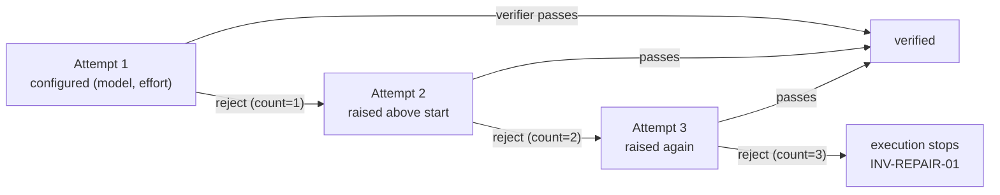

# Model & effort per role — concrete, per-role, host-grouped

This concern continues from [design.md](./design.md). It reduces per-agent
inference cost and latency by running the right **(model, reasoning-effort)** for
each role, and it is **invariant-neutral by construction**.

The unit is a concrete `(model, effort)` pair, not an abstract "tier" — a real
model id and a real effort level (`low` … `max`). Both are latency levers: a
smaller model *and* a lower effort each finish sooner. The user names the actual
values they want; there is no `cheap`/`top` vocabulary and no hidden per-host
mapping between an abstract label and a real model.

## Where this is allowed to live

Two invariants place it precisely:

- **INV-RUNTIME-01** forbids the runtime from containing model prompts or provider
  launch code. So the engine stays model-blind: it never selects, records-as-
  authoritative, or reasons about a model. Selection is a **coordinator/host**
  decision.
- **INV-HOST-01** makes model and provider bounded, provider-neutral host evidence
  that "never authorizes a route, role, lease, gate, verification, or completion."
  So `(model, effort)` can change cost and speed but never meaning. The values used
  may be *recorded as host evidence*; they can never *gate* anything.

Together: this is a performance knob the coordinator applies and records, and the
runtime never learns about. That is why it needs no new invariant.

## The config — concrete, per role, host-local, grouped by host

The configuration names real `(model, effort)` values per role. Because a model id
only means something on a host that offers it, and one user may run different plans
on different hosts, the config is **grouped by host**: each `hosts.<id>` group
names the models available on that host.

```yaml
# host-local, per-user, gitignored — one group per host you use
hosts:
  <host-id>:                 # the host adapter's own id (the CLI/agent you run)
    worker:
      model: <a-capable-model-on-this-host>
      effort: high
      escalate_on_repair: true
    verifier:
      model: <a-cheaper-model-on-this-host>
      effort: medium
      escalate_on_repair: false   # hard pin — same (model, effort) every attempt
  <another-host-id>:
    worker:   { model: <a-model-on-that-host>, effort: high }
    verifier: { model: <a-model-on-that-host>, effort: medium }
```

- **Grouped by host.** The coordinator reads the group matching the host it runs on
  (its own `host_evidence` id). The same workspace run from a different host reads
  that host's own group; a host with no group uses the adapter defaults.
- **Only `worker` and `verifier`** appear in a group. The **coordinator** is the
  root session the user already controls at the host level (its own model/effort
  controls); the design defers to it and never auto-retiers it, so it needs no
  entry.
- **`escalate_on_repair`** is per role: `false` is a hard pin; `true` makes the
  configured `(model, effort)` the *starting point and floor* (see below).
- **Adapter-shipped defaults.** When the current host has no group, or a role is
  unset, the host adapter supplies a sensible concrete default for that host
  (typically the coordinator session's own current model). There is no abstract
  default to resolve.

### Where it lives — host-local, per-user

Model ids are host/provider-specific, and each person's preference differs, so this
config is **host-local and per-user**, in the same category as
`repositories.local.yaml`: `role-tiering.local.yaml` at the workspace root,
gitignored, never part of shipped template or workspace state, and an upgrade
neither creates nor preserves it. Grouping by host lets one file serve a user
across all their hosts without holding a machine-specific path — so unlike
`repositories.local.yaml` it is safe for a user to sync across their own machines,
though it is still a per-user preference, not portable workspace identity.

This resolves the earlier open question of "where per-role config lives": a single
host-local, host-grouped file of concrete values, with adapter defaults as the
fallback — no workspace schema, no abstract-tier mapping table.

## Applying the tier — recording is not running

The sharpest lesson from building this: **reading and recording a `(model, effort)`
does not, by itself, change what runs.** The coordinator can read the config and
faithfully record `verifier_model: <cheaper>` as host evidence while still spawning
the verifier at its own session model — and then nothing has actually been tiered.
The recorded value is *intent*; the model the sub-agent truly ran is a separate
fact (it lives in the host's sub-agent transcript, not workspace state).

So application is an explicit host-adapter step: when the coordinator launches the
worker or verifier child, the adapter **sets the model on that spawn** (for Claude
Code, the `Task`/subagent `model` parameter). A child launched with no model
override inherits the coordinator's session model — which is the whole tier
silently ignored. The host adapter (`wrapper/adapters/`) owns this mechanism; the
skills stay host-neutral and simply say "launch at the configured model".

**Effort may not be per-child on a host.** A host can expose a per-child model but
no per-child effort (Claude Code's spawn has no effort knob). Where per-child
effort is unavailable, effort is recorded as evidence but not applied, and tiering
degrades to **model-only** — no block, no error. The coordinator's own effort stays
the user's session control.

**What tiering buys, honestly.** On substantial tasks a smaller/cheaper model or
lower effort finishes sooner. On trivial tasks the wall-clock difference is small,
because fixed overhead (reading the brief, git plumbing, tool round-trips)
dominates, not token generation; there the real lever tiering pulls is **cost**
(running the checker on a cheaper model) rather than latency. Both are legitimate;
the doc no longer claims a large latency win where the work is tiny.

## Escalate on repair

When `escalate_on_repair: true`, the configured `(model, effort)` is the **start
and the floor**; a repair may raise it, never lower it. The signal is free: the
work **failed once**, which is evidence it needs more capability. This composes
with the existing failure counter:

- Attempt 1 (initial implementation) runs the role at its configured `(model,
  effort)`.
- On each verifier rejection, the repair attempt raises effort and/or model above
  the configured start.



**The adapter owns the escalation ladder above the user's start**, because only the
host knows the ordering of its own model catalog. Effort has a host-neutral order
(`low` < … < `max`) the coordinator can walk directly; model ordering is
adapter-specific. `escalate_on_repair: false` disables the ladder entirely — the
pin holds for every attempt.

### It must not touch the accounting

INV-REPAIR-01 is unchanged: the worker-failure counter still increments on **every**
rejection including the initial implementation, and three still stops execution.
Escalation changes *which model runs attempt N*, never *what a rejection costs*. A
rejection at the configured start is a real failure and counts; escalation never
buys extra attempts. INV-EXEC-04 is unchanged too — each repair is still a new
commit.

### The honest consequence of a hard pin

If a user pins the worker to a small model + low effort with escalation off, the
three-failure limit may be reached more often, because the system can no longer add
capability on repair. That is the user's tradeoff to own, not a bug — but the
coordinator's report must make it visible: "stopped after three attempts; the
worker was pinned to <model>/<effort>, so no capability was added on repair." The
system respects the pin and tells the truth about its cost; it never silently
escalates past a pin to rescue the run.

## Optional per-plan complexity hint

Escalate-on-repair reacts *after* one failed attempt. When a plan is known hard up
front, `cc-plan` may record an **optional** `complexity` on the plan (`plan.yaml`,
additive, default absent) that nudges the start **one step above** the configured
`(model, effort)` for attempt 1, then escalates as usual. It is a hint, not a gate:
absent, behavior is exactly the config above; present, it only shifts the starting
point up. A hard pin (`escalate_on_repair: false`) ignores the hint.

## Verifier independence is preserved

Independence is defined by role and access, not model:

- INV-VERIFY-01: one independent verifier, read-only on committed state, never
  repairing or self-verifying.
- INV-VERIFY-02: no independent verifier child ⇒ `host-blocked`, never self-verify.

A verifier on a smaller model is still a **separate agent invocation** inspecting
the worker's committed result, so it remains independent. A user may even set the
**same** `(model, effort)` for worker and verifier — that does **not** break
independence, because independence is separate-agent-reading-committed-state, never
different-model. What this must never do is let cost pressure collapse the worker
and verifier into one invocation, or let a verifier "reuse" the worker's context.
The rule is: separate agent always; `(model, effort)` is free to vary.

## Recording and honesty

- The coordinator records the `(model, effort)` used per attempt as host evidence
  ([measurement.md](./measurement.md)), enabling a first-try-pass-rate read; timing
  itself is the attempt's own `started_at`/`checked_at` span, not part of this
  record.
- A host that exposes only one model runs everything on it; escalation silently
  degrades to raising effort only, or to uniform — no block, no error.
- The values are never surfaced to a lay user as mechanism (doc-01 reporting
  rules); they appear only under explicit diagnostics.

## Boundaries

- Selection lives in the coordinator/host, never in `wrapper/runtime/engine.sh`
  (INV-RUNTIME-01).
- `(model, effort)` authorizes nothing (INV-HOST-01) and never changes the failure
  counter (INV-REPAIR-01) or the independence requirement (INV-VERIFY-01/02).
- The config is **host-local, per-user, and grouped by host**; adapter defaults
  fill any unset host or role. It is never shipped template or workspace state.
- Applying the tier is a host-adapter step (set the model on the spawn); recording
  it alone changes nothing. Per-child effort may be unavailable on a host, in which
  case tiering is model-only.
- A hard pin is respected even at the third failure, and its cost is reported
  honestly — never silently overridden.
- No new invariant. The only additive contract surface is the optional `complexity`
  plan field; the per-role config shape, the spawn-application mechanism, and the
  adapter defaults are host-adapter concerns that settle in `wrapper/adapters/`.

## Open questions

- **Adapter escalation ordering.** Exactly how each adapter raises `(model,
  effort)` above the user's start on repair (effort-first then model, and the model
  catalog order) is a host-adapter detail, not fixed here.
- **Adapter default values.** The concrete `(model, effort)` an adapter uses for an
  unset role is a per-host choice shipped with the adapter.
