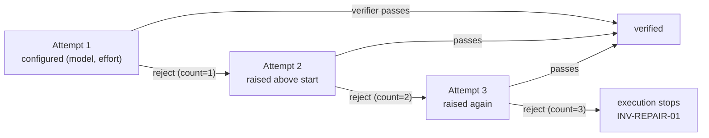

# Model & effort per role — concrete, per-role, host-local

This concern continues from [design.md](./design.md). It reduces per-agent
inference cost and latency by running the right **(model, reasoning-effort)** for
each role, and it is **invariant-neutral by construction**.

The unit is a concrete `(model, effort)` pair, not an abstract "tier" — a real
model id and a real effort level (`low` … `max`). Both are latency levers: a
smaller model *and* a lower effort each finish sooner. The user names the actual
values they want; there is no `cheap`/`top` vocabulary and no hidden per-host
mapping between an abstract label and a real model.

## Where this is allowed to live

Two invariants place it precisely:

- **INV-RUNTIME-01** forbids the runtime from containing model prompts or provider
  launch code. So the engine stays model-blind: it never selects, records-as-
  authoritative, or reasons about a model. Selection is a **coordinator/host**
  decision.
- **INV-HOST-01** makes model and provider bounded, provider-neutral host evidence
  that "never authorizes a route, role, lease, gate, verification, or completion."
  So `(model, effort)` can change cost and speed but never meaning. The values used
  may be *recorded as host evidence*; they can never *gate* anything.

Together: this is a performance knob the coordinator applies and records, and the
runtime never learns about. That is why it needs no new invariant.

## The config — concrete, per role, host-local

The configuration names real `(model, effort)` values per role, plus one flag:

```yaml
# host-local Context Circuit config — NOT portable workspace state
worker:
  model: opus
  effort: high
  escalate_on_repair: true
verifier:
  model: sonnet
  effort: medium
  escalate_on_repair: false   # hard pin — same (model, effort) every attempt
```

- **Only `worker` and `verifier` appear.** The **coordinator** is the root session
  the user already controls at the host level (Claude Code `/model`, `/fast`,
  effort); the design defers to it and never auto-retiers it, so it needs no entry.
- **`escalate_on_repair`** is per role: `false` is a hard pin; `true` makes the
  configured `(model, effort)` the *starting point and floor* (see below).
- **Adapter-shipped defaults.** When a role is unset, the host adapter supplies a
  sensible concrete default for that host. There is no abstract default to resolve.

### Why host-local, not portable workspace state

Model ids are inherently host/provider-specific — "opus" or a given effort level
only means something on a host that offers it — and model/provider is
non-authoritative host evidence by INV-HOST-01. So this config is **host-local**,
in the same category as `.claude/`: it is never part of shipped template or
workspace state, never travels with the workspace, and an upgrade neither creates
nor preserves it. A user configures it once for the host they work on; a different
host has its own file (or just its adapter defaults). Nothing about it is portable,
and nothing needs to be — unlike the workspace's logical repository identity
(INV-REPO-01), which is portable precisely because it holds no host-specific value.

This resolves the earlier open question of "where per-role config lives": it is a
single host-local file of concrete values, with adapter defaults as the fallback —
no workspace schema, no abstract-tier mapping table.

## Escalate on repair

When `escalate_on_repair: true`, the configured `(model, effort)` is the **start
and the floor**; a repair may raise it, never lower it. The signal is free: the
work **failed once**, which is evidence it needs more capability. This composes
with the existing failure counter:

- Attempt 1 (initial implementation) runs the role at its configured `(model,
  effort)`.
- On each verifier rejection, the repair attempt raises effort and/or model above
  the configured start.



**The adapter owns the escalation ladder above the user's start**, because only the
host knows the ordering of its own model catalog. Effort has a host-neutral order
(`low` < … < `max`) the coordinator can walk directly; model ordering is
adapter-specific. `escalate_on_repair: false` disables the ladder entirely — the
pin holds for every attempt.

### It must not touch the accounting

INV-REPAIR-01 is unchanged: the worker-failure counter still increments on **every**
rejection including the initial implementation, and three still stops execution.
Escalation changes *which model runs attempt N*, never *what a rejection costs*. A
rejection at the configured start is a real failure and counts; escalation never
buys extra attempts. INV-EXEC-04 is unchanged too — each repair is still a new
commit.

### The honest consequence of a hard pin

If a user pins the worker to a small model + low effort with escalation off, the
three-failure limit may be reached more often, because the system can no longer add
capability on repair. That is the user's tradeoff to own, not a bug — but the
coordinator's report must make it visible: "stopped after three attempts; the
worker was pinned to <model>/<effort>, so no capability was added on repair." The
system respects the pin and tells the truth about its cost; it never silently
escalates past a pin to rescue the run.

## Optional per-plan complexity hint

Escalate-on-repair reacts *after* one failed attempt. When a plan is known hard up
front, `cc-plan` may record an **optional** `complexity` on the plan (`plan.yaml`,
additive, default absent) that nudges the start **one step above** the configured
`(model, effort)` for attempt 1, then escalates as usual. It is a hint, not a gate:
absent, behavior is exactly the config above; present, it only shifts the starting
point up. A hard pin (`escalate_on_repair: false`) ignores the hint.

## Verifier independence is preserved

Independence is defined by role and access, not model:

- INV-VERIFY-01: one independent verifier, read-only on committed state, never
  repairing or self-verifying.
- INV-VERIFY-02: no independent verifier child ⇒ `host-blocked`, never self-verify.

A verifier on a smaller model is still a **separate agent invocation** inspecting
the worker's committed result, so it remains independent. A user may even set the
**same** `(model, effort)` for worker and verifier — that does **not** break
independence, because independence is separate-agent-reading-committed-state, never
different-model. What this must never do is let cost pressure collapse the worker
and verifier into one invocation, or let a verifier "reuse" the worker's context.
The rule is: separate agent always; `(model, effort)` is free to vary.

## Recording and honesty

- The coordinator records the `(model, effort)` used per attempt as host evidence
  (pairs naturally with `worker_wall_s` / `verifier_wall_s` from
  [measurement.md](./measurement.md)), enabling a first-try-pass-rate read.
- A host that exposes only one model runs everything on it; escalation silently
  degrades to raising effort only, or to uniform — no block, no error.
- The values are never surfaced to a lay user as mechanism (doc-01 reporting
  rules); they appear only under explicit diagnostics.

## Boundaries

- Selection lives in the coordinator/host, never in `wrapper/runtime/engine.sh`
  (INV-RUNTIME-01).
- `(model, effort)` authorizes nothing (INV-HOST-01) and never changes the failure
  counter (INV-REPAIR-01) or the independence requirement (INV-VERIFY-01/02).
- The config is **host-local**, concrete, and non-portable; adapter defaults fill
  any unset role. It is never shipped template or workspace state.
- A hard pin is respected even at the third failure, and its cost is reported
  honestly — never silently overridden.
- No new invariant. The only additive contract surface is the optional `complexity`
  plan field; the per-role config shape and adapter defaults are host-adapter
  concerns that settle in `wrapper/adapters/` on acceptance.

## Open questions

- **Adapter escalation ordering.** Exactly how each adapter raises `(model,
  effort)` above the user's start on repair (effort-first then model, and the model
  catalog order) is a host-adapter detail, not fixed here.
- **Adapter default values.** The concrete `(model, effort)` an adapter uses for an
  unset role is a per-host choice shipped with the adapter.
