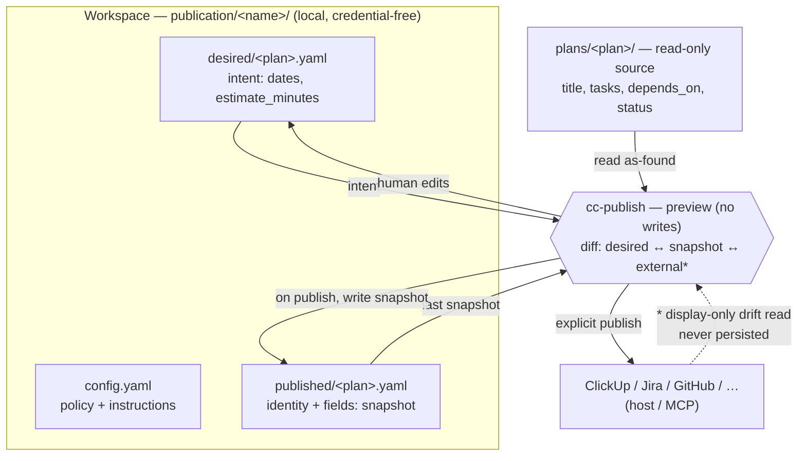

# Context Circuit v0.7.0 — Publication field metadata (overview)

Status: source design for the v0.7.0 publication-fields scope (delta on v0.6
external-surface)
Revision: 1 — 2026-08-29

This is the **overview** of the scope: the capability, the problem, the principles,
the fixed decisions, and the shape of the solution. Each mechanism has its own
detail file — read [README.md](./README.md) for the index, and the v0.6
[external-surface/design.md](../../v0.6/external-surface/design.md) for everything
this delta builds on.

## The one capability

v0.6 gives a publication a home to push a plan and its tasks outward, and a record
under `publication/<name>/published/<plan-id>.yaml` that maps each plan/task to the
external work item it created. That record stores **identity** — the external
`id`/`url`, and a `synced_digest` of the *task content* — so a re-run updates the
same item instead of duplicating it.

What it does **not** store is the **provider field values** the publication pushed:
the start/due dates, the time estimate, the dependency realization. Those exist in
only two places today: as **free prose** inside `config.yaml` `instructions:` (the
schedule recipe — "0021 2h, 0022 3h…"), and as **live state in the external
system**. Neither is a structured, local, per-plan record the agent can read.

The consequence the user hit directly: to review or change a Date or a time
estimate, the agent has *no local data about what it sent* — only that it sent
something, and where. It must read the provider live. And the v0.6 contract's
one-way rule ("never read it back") was written for **status** but currently reads
as a blanket ban, so even a read-to-display is contract-ambiguous.

This scope closes that gap **without** making the external system authoritative. It
adds a structured local home for the field intent, snapshots what was actually
pushed, and turns publishing into a **consult-first** flow: preview the diff, talk
it over, edit, then push.

## Problem

Three distinct things are conflated today, and only two are persisted:

| Layer | What it is | Where it lives in v0.6 |
| --- | --- | --- |
| **Intent** — desired dates / estimates | "0021 = 2h, starts 2026-09-14" | free prose in `config.yaml` `instructions:` |
| **Receipt** — identity mapping | `plan_item.id`, per-task `id`/`url`/`synced_digest` | `published/<plan-id>.yaml` |
| **Field values pushed** | the `start_date`/`due_date`/estimate actually sent | **nowhere** — the digest hashes task *content*, not field values |

Because the intent is prose and the pushed values are unrecorded, every review or
change of a field forces a live read of the provider, and there is no local diff to
reason about *before* pushing. The naïve fix — read the provider back into the
workspace — is exactly wrong: it hands an outside system a foothold on local state
and breaks the one-way boundary the whole external surface is built on.

## Goals

1. Give **publishable provider fields** (dates, time estimate) a **structured,
   local, per-plan, diffable** home, replacing the prose schedule as the source of
   *intent*.
2. Record **what was actually pushed** so the agent can answer "what did we send?"
   and "what changed?" **without** reading the provider.
3. Make publishing **consult-first**: a manual preview renders a plain-language
   diff, the human and agent edit the intent, and only an explicit "publish" pushes.
4. Keep the estimate unit **exact and portable** — canonical integer minutes, a
   friendly `"2h 30m"` / `"15m"` format for input and display.
5. Preserve every v0.6 boundary: one-way, export-only, non-authoritative,
   credential-free, self-contained, orthogonal to the core workflow.

## Non-goals

- **No inbound sync / no authority flow-back.** External state never returns to
  `plan.yaml` or to any core artifact. A display-only drift *read* is not ingestion
  (see [consult-and-preview.md](./consult-and-preview.md)); nothing read is
  persisted to the workspace.
- **No new trigger.** Publishing and its preview stay **manual** (INV-EXTERNAL-01).
  The preview is a mode of `cc-publish`, not a new skill and not an automatic step.
- **No coupling to the core workflow.** Nothing here is a plan/approve/execute/
  verify/deliver step, and none of them reads `desired/` or the snapshot.
- **No credentials or provider payloads** in `desired/`, the record, or anywhere
  under `publication/` (INV-SEC-01).
- **No day/week unit in an estimate.** A "day" is a scheduling *policy* (its hours
  are provider- and config-relative), so it stays in `instructions:`, never in a
  duration field.
- **No status semantics change.** Status still flows one-way out of `plan.yaml`
  through the config `status:` map, unchanged (INV-PLAN-01).

## Principles

- **Local owns intent; external is a projection.** The `desired/` layer is the
  source of truth for the *values we want*; the provider holds a copy that may
  drift. The workspace never reads the provider's copy as authority.
- **Store canonical, speak human.** Field values are stored in an unambiguous,
  diff-stable canonical form (integer minutes, ISO dates); the friendly `"2h 30m"`
  form exists only at the I/O boundary — typed in the consult session, rendered in
  the diff.
- **Policy in `instructions:`, values in `desired/`.** `instructions:` keeps the
  wording, language, tone, and *schedule policy* (workday hours, weekends skipped);
  the concrete resolved per-plan values move into structured `desired/` files.
- **Snapshot what you push.** Every publish records the field values it sent, so
  the next review is a local diff, not a provider round-trip.
- **Consult before side effects.** The default path to changing external fields is
  a preview-and-confirm conversation, not a blind push.

## Fixed decisions

1. **A user-owned `desired/` layer.** `publication/<name>/desired/<plan-id>.yaml`
   holds the structured field intent for a plan (dates, estimate) that is *not*
   derivable from the plan itself. Created by deriving a first draft from the
   `instructions:` policy on first publish, then human-owned. Detail in
   [desired-and-record.md](./desired-and-record.md).
2. **`estimate_minutes` is canonical.** Integer minutes on disk — exact (no float
   `2.5h`), diff-stable (one representation per value), and convertible to every
   provider. The `"2h 30m"` / `"15m"` format is input/display only, `h` and `m`
   units only; no `d`/`w`.
3. **The record gains a `fields:` snapshot.** `publication-record.yaml` adds a
   per-item `fields:` block capturing the values last pushed (`start_date`,
   `due_date`, `estimate_minutes`). Idempotency and drift now cover fields, not just
   the content digest. Still credential-free and non-authoritative.
4. **`cc-publish` gains a preview mode.** A manual, no-write dry run that renders a
   plain-language diff of `desired/` vs the last-published snapshot (and, if the
   author opts in, vs external current), for the consult session. Publish stays a
   separate explicit action.
5. **One contract delta: a display-only drift read.** Reading provider field values
   *to display a diff* is permitted and is distinct from the forbidden
   read-it-back-into-the-workspace. It writes nothing to any workspace file and
   never touches `plan.yaml`. This is a clarification of INV-EXTERNAL-02, owned
   where the invariant is owned (`wrapper/contracts/invariants.yaml`) — not a new
   invariant. Detail and exact wording delta in
   [consult-and-preview.md](./consult-and-preview.md).

## Shape of the solution

The three local files divide cleanly: `config.yaml` owns policy, `desired/` owns
the resolved per-plan intent, `published/` owns identity plus the last-pushed
snapshot. The provider is downstream of all three and never upstream of any of
them. The dashed edge is the only new read of the provider, and it is display-only.

## Detailed design

- [desired-and-record.md](./desired-and-record.md) — the `desired/` schema, the
  `estimate_minutes` unit and `"2h 30m"` format, the record `fields:` snapshot, and
  provider conversion.
- [consult-and-preview.md](./consult-and-preview.md) — the preview mode, the diff
  it renders, and the INV-EXTERNAL-02 clarification.

## Authority

This scope adds **no new invariant** and **no new skill**. It adds:

- additive schema fields — a new `desired/` file schema and a `fields:` block on
  `publication-record.yaml` (owners under `wrapper/contracts/schemas/`);
- a mode of the existing `cc-publish` skill (preview / consult), with no new route
  or authority (INV-SKILL-01);
- a **wording clarification** to INV-EXTERNAL-02 distinguishing a display-only
  drift read from the forbidden authority flow-back, owned at
  `wrapper/contracts/invariants.yaml`.

Everything stays orthogonal to the core workflow (INV-EXTERNAL-01), export-only and
one-way (INV-EXTERNAL-02), self-contained (INV-EXTERNAL-03), credential-free
(INV-SEC-01), and free of any runtime provider action (INV-RUNTIME-01).
