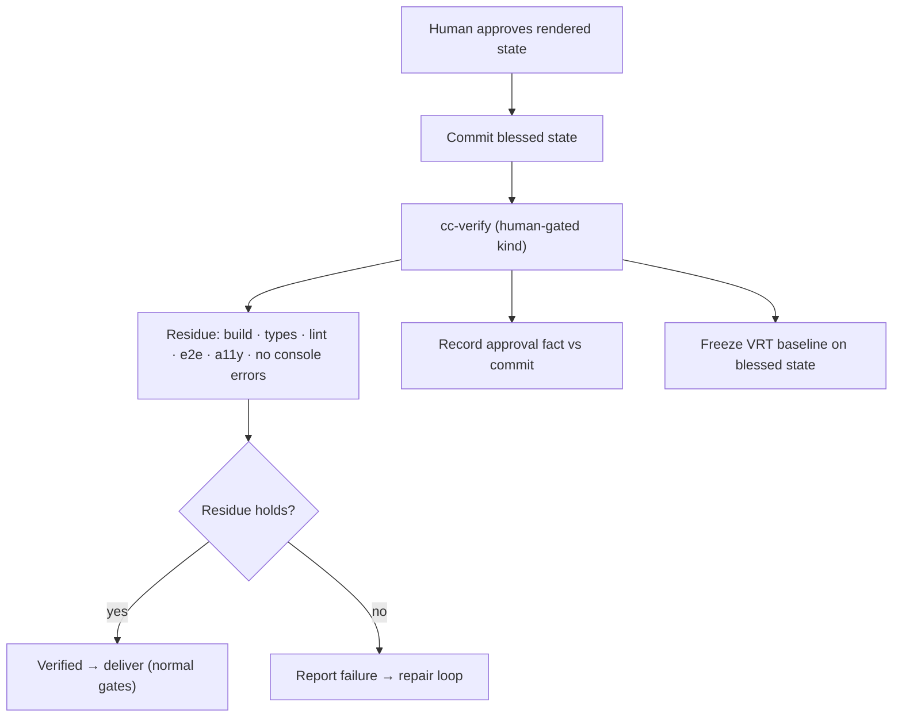

# acceptance-and-verification

Continues [design.md](./design.md). This file specifies the **human-gated visual
acceptance** kind, the **single end verify**, and the **visual-regression baseline
freeze** that converts a subjective approval into a durable, observable gate — while
keeping the verifier independent and read-only. The loop that precedes this is in
[refinement-loop.md](./refinement-loop.md).

## The human-gated visual acceptance kind

A plan's acceptance criteria gain a new kind whose oracle is a **human approving a
rendered artifact**, not a runnable assertion. It carries:

- the **target(s)** to render (screen / route / component),
- the **breakpoints** to check (e.g. mobile, tablet, desktop),
- the **objective residue** — the parts of "looks good" that *are* runnable and must
  hold regardless of taste,
- and a reference to the **approval fact** recorded when the human blesses a state.

This kind tells the whole system that the terminal authority for this criterion is a
human, so nothing tries to auto-judge taste and nothing treats the loop as "stuck."

## Split "looks good" into two piles

The design's move is to never verify taste, but to verify everything around it.

- **Objective residue — the verifier runs these and reports evidence:** renders with
  no console errors / no hydration mismatch; no overflow or clipping; responsive at
  the named breakpoints; matches the design tokens / target frame; passes the
  approved visual-regression baseline; accessibility (contrast, focus order, hit
  targets).
- **Irreducibly subjective part — the verifier never rules on it:** hierarchy,
  balance, "does it feel right." The only contribution here is to make the artifact
  observable so the human can judge; the human's approval is the evidence.

## The single end verify

When the human approves and the blessed state is committed, the independent verifier
runs **once** (through `cc-verify`, recognizing the human-gated kind) and:

1. **Verifies the objective residue** — build, typecheck, lint, e2e, a11y, no
   console errors — reporting observable evidence, pass/fail with output, exactly as
   for any runnable criterion.
2. **Records the human approval as the anchoring fact** — the criterion is met
   because the human, the designated oracle, approved this rendered state; the
   verifier confirms *that this approval occurred against this commit*, it does not
   re-derive the aesthetic judgment.
3. **Freezes the visual-regression baseline** on the blessed state (see below).

If the residue fails, that is a normal failed verification routed to repair within
the failure limit — the human's taste approval does not paper over a broken build or
an a11y regression.

## The baseline freeze — subjective approval → observable gate

Visual-regression testing (screenshot baselines) is the one tool that turns "looks
like the blessed version" into observable evidence. Its timing is the point:

- **During refinement it is noise** — the baseline is *supposed* to change every
  iteration, so VRT cannot guide the loop.
- **At approval it becomes the gate** — freezing the baseline on exactly the state
  the human blessed captures that one subjective act as a durable, observable
  contract that protects the look from there on. Any later drift from the approved
  pixels is now a runnable failure.

So the human's single "that's it" is laundered — legitimately — into a permanent,
re-runnable check, without any agent ever having judged taste.

## Independence is preserved

Nothing here weakens the verifier's contract. It stays independent of the worker and
read-only. It verifies the residue by running things, and it verifies the *fact* of
approval (an observable event tied to a commit) rather than the *content* of the
aesthetic call. "The human approved this rendered commit" is an observable truth the
verifier can establish; "this looks good" is not, and it never asserts it.

## `host-blocked` applies here too

If the end verify's host cannot render (no way to reproduce the artifact or run
VRT), it reports `host-blocked` and stays read-only rather than passing the visual
residue blind. The approval fact may be recorded, but the residue and baseline
freeze wait for a host that can render.
