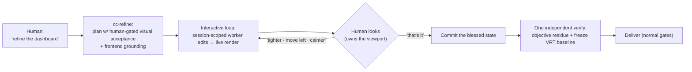

# Context Circuit v0.7.0 — UI Refinement (overview)

Status: authoritative source design for the v0.7.0 ui-refinement scope (delta on
v0.6)
Revision: 1 — 2026-08-29

This is the **overview** of the ui-refinement scope: the capability, the
principles, the central decision, and the shape of the solution. Each mechanism
has its own detail file (see [Detailed design](#detailed-design)). Read
[README.md](./README.md) first for the index, and
[../../v0.5/core/design.md](../../v0.5/core/design.md) for everything this delta
builds on.

## The one capability

v0.5/v0.6 execute a plan against **runnable acceptance criteria** — a worker
writes, an independent verifier *runs things* and reports observable evidence of
pass or fail. That model assumes the criterion has an objective oracle.

Some work does not. "Refine the dashboard until it looks good," "tighten this
layout," "make it feel calmer" — the acceptance criterion is **subjective taste**,
and the only competent oracle is a **human looking at the rendered result**. v0.7.0
adds the mode for exactly this: an **interactive, human-gated refinement loop**
that keeps the human as the live acceptance oracle while refining, and converges
into a single independent verification at the end that locks in what the human
blessed — *without* pretending an agent verified taste, and *without* collapsing
any role.

The product experience is one continuous conversation with what feels like a senior
frontend engineer. Underneath, the authority model is untouched: the thing that
**talks** (coordinator) is not the thing that **writes** (worker) is not the thing
that **verifies** (independent verifier).

## Problem

Three problems compound when a user asks Context Circuit to refine a UI:

1. **The verifier has no oracle for taste.** Forcing "looks good" through the
   runnable-acceptance path either makes the verifier *opine* — an AI substituting
   its taste for the human's and stamping fabricated authority — or makes it verify
   some proxy that misses the actual criterion. Both are wrong.
2. **The ceremony fights the cadence.** Refinement is dozens of tiny, taste-driven
   edits ("move the padding 4px"). Wrapping the full plan → spawn-worker →
   spawn-independent-verifier ceremony around each nudge is theater: it is slow,
   it discards the worker's context every tweak, and there is nothing objective to
   independently verify per tweak.
3. **The instinct is to make the root session "the frontend expert."** That reads
   as the simplest fix, but it quietly hands the coordinator write authority and
   destroys the coordinator/worker/verifier separation the product is built on.

## Goals

1. Support taste-driven refinement as a first-class mode entered by intent or by
   `/cc-refine`, in plain conversational language.
2. Keep the **human as the acceptance oracle** during refinement; never let an
   agent rule on "looks good."
3. Give the human the tightest possible loop — react to a live render in their own
   words, no manual verifier calls, no baseline bookkeeping, no role management.
4. Convert the human's subjective approval into a **durable, observable gate** at
   the end (a frozen visual-regression baseline) so the look is protected going
   forward.
5. Preserve every core guarantee: no self-verification, one independent verify of
   the objective residue, human-controlled completion, separate delivery,
   `host-blocked` honesty when the host cannot render.

## Non-goals

- **No new role.** Domain competence is loaded context, not a new identity
  (see [roles-and-expertise.md](./roles-and-expertise.md)).
- **No agent judgment of taste.** The verifier verifies the *residue* and the
  *fact of human approval*, never the aesthetics.
- **No per-tweak independent verification.** Independence comes from the human gate
  plus one end verify, not from a verifier firing every edit.
- **No headless "it looks fine."** With no render surface the honest outcome is
  `host-blocked`, read-only.
- **No universal frontend knowledge base in the wrapper.** Repo-specific frontend
  context is grounded per project through the existing repository-grounding path.

## Principles (carried and added)

v0.7.0 keeps all v0.5/v0.6 principles and adds three:

- **Roles are authority-shaped, not domain-shaped.** A role is defined by what it
  may do in the verification chain, never by a domain. "Frontend expert" is
  competence that any role can *load*; it never becomes a role.
- **Taste is a human gate, verified around, never through.** The subjective
  criterion is owned by a human approving a rendered artifact. The system verifies
  everything true *around* that approval and captures the approval itself as the
  anchoring fact.
- **Refinement is interactive orchestration inside the normal spine.** The loop is
  a distinct cadence, but it is still bracketed by a plan, a lease, one independent
  verify, and separate delivery — a specialization of execution, not a bypass of
  it.

## The central decision — no new role

The user-facing question was "do we need a new agent role that turns the root
session into an expert frontend engineer?" The answer is **no**, and it is the
spine of this design:

- Context Circuit roles encode **authority and independence** — coordinator
  (interface, never writes, never self-verifies), worker (bounded write, never
  self-verifies), independent verifier (read-only, independent). None is defined by
  a domain.
- "Expert frontend engineer" is a **domain competence**, orthogonal to authority.
  Turning the *root session* into it grants the coordinator write authority and
  collapses the separation; turning it into a *new writing identity* fragments the
  worker role by domain and multiplies endlessly (backend expert, data expert, …)
  without adding any authority distinction.
- Resolution: the competence is **loaded context adopted by existing roles** — the
  **worker** is grounded in the target repo's frontend context plus the universal
  UI procedure the `cc-refine` skill carries (so it edits like an expert), and the
  **coordinator** gains enough frontend *fluency* to run the conversation (so it
  reads like an expert) — with no change to who may write or verify. This is
  exactly INV-SKILL-01: a skill grants competence, never authority.

Full argument in [roles-and-expertise.md](./roles-and-expertise.md).

## What changes relative to v0.6

| Area | v0.6 | v0.7.0 |
| --- | --- | --- |
| Acceptance criteria | runnable, objective oracle | adds a **human-gated visual** kind (oracle = human approving a rendered artifact at named breakpoints) |
| Execution cadence | plan → worker → independent verifier per plan | adds an **interactive loop** (session-scoped worker + live render) that defers the independent verifier to one end pass |
| Who judges "done" | the verifier's evidence | during refinement, the **human**; at the end, the verifier on the *residue* + the recorded approval |
| Domain expertise | none in the loop | **loaded context** (repo grounding + `cc-refine` procedure) adopted by worker and coordinator — no new role |
| Look protection | tests as written | a **visual-regression baseline frozen** at the moment of human approval |
| Skills | `cc-plan/execute/verify/deliver/...` | adds **`cc-refine`** |

Everything else in v0.6 is unchanged.

## Detailed design

- [roles-and-expertise.md](./roles-and-expertise.md) — no new role; authority vs
  domain; where competence attaches; INV-SKILL-01.
- [refinement-loop.md](./refinement-loop.md) — the interactive mode: session-scoped
  worker, turn cadence, the two rendering channels, `host-blocked`, lease/worktree
  bracketing, in-loop self-check ≠ self-verification.
- [acceptance-and-verification.md](./acceptance-and-verification.md) — the
  human-gated visual acceptance type, the single end verify, and the VRT baseline
  freeze; how independence is preserved.
- [skill-and-schema.md](./skill-and-schema.md) — the `cc-refine` skill surface, its
  relation to the other skills, triggering, and the contract delta (acceptance
  kind, provisional `INV-REFINE-01/02`, `runtime_version`).

## Compatibility (summary)

Backward compatible and opt-in. A plan with no human-gated acceptance kind behaves
exactly as under v0.6; `cc-refine` is only entered by intent or explicit
invocation. A host with no render surface reports `host-blocked` and stays
read-only rather than degrading silently. Contract detail in
[skill-and-schema.md](./skill-and-schema.md).

## Implementation order

Bounded, independently reviewable phases, each updating the semantic fixtures that
prove it:

1. **Acceptance kind** — add the human-gated visual acceptance kind to the plan
   acceptance model; a plan without it is unchanged.
2. **`cc-refine` skill** — the interactive mode: session-scoped worker, render
   channels, lease bracketing, `host-blocked` fallback, convergence on approval.
3. **Frontend grounding** — extend repository-grounding so the worker's brief
   carries the repo's frontend context (component lib, tokens, dev-server command,
   breakpoints, VRT tooling); universal UI procedure rides in the skill.
4. **End verify + baseline freeze** — `cc-verify` recognizes the human-gated kind:
   verify the residue, record the approval as the fact, freeze the VRT baseline.
5. **Semantic verification** — a worked refinement trace (intent → loop → approval
   → verify → baseline), plus the `host-blocked` and no-per-tweak-verify assertions.

This design does not authorize implementation, delivery, or publication by itself.

## Final design decisions

- v0.7.0 is a delta on v0.6; all v0.6 decisions remain in force unless superseded.
- **No new role.** Roles are authority-shaped; frontend expertise is loaded context
  adopted by the existing worker and coordinator.
- **One new skill, `cc-refine`**, owning the interactive human-gated refinement
  mode; it grants no authority (INV-SKILL-01).
- Refinement is a **specialization of execution**, bracketed by one plan, one
  lease/worktree, one independent end verify, and separate delivery — never a
  bypass, never per-tweak independent verification.
- Acceptance criteria gain a **human-gated visual** kind whose oracle is a human
  approving a rendered artifact at named breakpoints.
- The independent verifier at the end verifies the **objective residue** and the
  **recorded fact of approval**, and **freezes a visual-regression baseline** on
  the blessed state; it never judges taste.
- In-loop visual self-check by the worker is **not** self-verification, because the
  terminal authority is the human gate plus one independent verify.
- With no render surface the outcome is **`host-blocked`, read-only** — never a
  headless "looks fine."
- Provisional `runtime_version` `0.7.0`; provisional `INV-REFINE-01/02`; final IDs
  and schema integers settle in `wrapper/contracts/` on acceptance.
