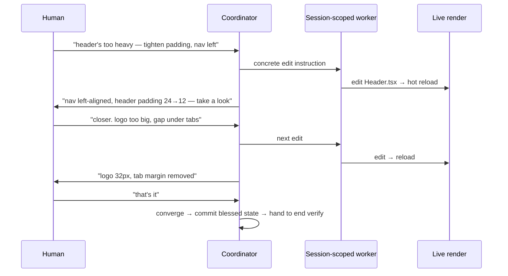

# refinement-loop

Continues [design.md](./design.md). This file specifies the **interactive execution
mode** `cc-refine` runs: who is in the loop, the turn cadence, how pixels reach the
human, the `host-blocked` fallback, and how the loop sits inside one lease/worktree.
Acceptance and the end verify are in
[acceptance-and-verification.md](./acceptance-and-verification.md).

## Who is in the loop

During refinement the live participants are **human ↔ coordinator ↔ a
session-scoped worker**. The independent verifier is deliberately **out** until the
end — the human is the acceptance oracle while refining, so a verifier per tweak
would verify nothing.

- **Session-scoped worker.** One worker stays warm across the whole refinement
  stretch, taking successive small instructions with shared context — not a fresh
  bounded packet re-spawned per edit. Re-spawning cold every nudge would discard the
  accumulated state and cost disproportionately.
- **Coordinator delegates, never writes.** It interprets the human's taste language,
  hands the worker a concrete edit, narrates what changed, and presents the result.
  It does not itself edit (see [roles-and-expertise.md](./roles-and-expertise.md)).

## The turn cadence

The loop repeats at the speed of the human's eye. Nothing is "done" until the human
says so.

## Rendering — two channels

How pixels reach a judge depends on whether the **agent** needs to see them or only
the **human** does.

- **Channel A — human owns the viewport (fast default).** The workspace dev server
  runs; the human watches their own browser with hot reload. The coordinator does
  not screenshot — it just narrates what changed so the human knows where to look.
  This is the tightest loop and what most humans want.
- **Channel B — the agent also sees.** When a check needs the agent to reason about
  the actual pixels (did it overflow at mobile width? did contrast drop?), the
  coordinator drives the browser tool, screenshots, and returns the frame inline so
  human and agent share one view. Slower; used to punctuate Channel A and to gather
  the objective residue.

Most sessions are Channel A for taste with Channel B punctuation for concrete
checks.

## `host-blocked` — no headless "looks fine"

Refinement requires a render surface. If the host has no way to put pixels in front
of the human (no dev server, no browser tool, no preview), the honest outcome is
**`host-blocked`, read-only**. The coordinator must not "decide it looks fine" —
that would be an agent ruling on taste, the one thing this mode forbids. This mirrors
the shared `host-blocked` contract: if the required capability is unavailable,
preserve the read-only outcome and do not self-verify.

## Bracketing — one lease over the whole stretch

The interactive loop lives inside the normal execution spine:

- **One lease / worktree for the whole refinement**, acquired once — not
  re-acquired per tweak. Under INV-OWN-01 the stretch holds the one-writer lock over
  the touched paths for its duration; the nudges are edits within it.
- **Edits are uncommitted working state until blessed.** The worker must not mint
  "done"/"verified"-looking commits mid-loop. The commit that matters is the single
  one taken when the human approves; that commit is what the end verify runs against
  (INV-COMMIT-01 format, no agent attribution).
- **Convergence is explicit.** "That's it" (or equivalent) is the signal that closes
  the loop; the coordinator commits the blessed state and hands off to the end
  verify. There is no implicit completion.

## In-loop self-check is not self-verification

The worker (Channel B) may screenshot and inspect its own output to decide the next
edit. This is **not** the forbidden self-verification, because the worker is not
claiming a verified "done": the terminal authority is the **human gate plus one
independent end verify**. Self-inspection to iterate ≠ self-approval to complete.

## Why not per-tweak plan → execute → verify

Stated plainly so the mode is not "corrected" back into ceremony: wrapping the full
worker-then-independent-verifier packet around each aesthetic micro-edit is slow,
throws away the worker's context every tweak, and independently verifies something
with no objective oracle. The independence the product requires is delivered once,
at the end, on the blessed state — not thirty times on padding values.
