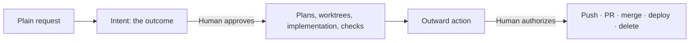

# Authority and delivery

Where a human decides, what an authorization covers, and why delivery,
completion, and cleanup are separate acts.

## Two decisions, and nothing simulating one

### Decision 1 — approving the intended outcome

Before detailed code investigation, the agent writes an intent — goal, non-goals,
constraints, observable success criteria, rough repository scope — using relevant
existing knowledge, and presents it concretely.

The rule that carries the weight:

> Neither a command, an editable approval note, nor another agent can supply
> human consent.

`record approve` *records* an actual decision; it does not constitute one. The
approval note carries the real user approval and the instant, and approval
returns `planning_required` — what it authorizes is planning, and planning alone.
The request that prompted an intent is not approval of it: a person approves the
outcome after reading how it was written down, so "add billing" is not consent to
the intent derived from it. And in the other
direction: approval already supplied in the conversation for that exact outcome
is honored, not re-requested. Asking twice for the same thing is its own failure
mode — it teaches people to approve reflexively.

**Re-approval** is required only when the intended outcome or its success
criteria materially change. A newly needed file or repository *within* the
approved outcome is explained and recorded, not re-gated. Plan paths are
descriptive planning information, not an enforcement contract.

### Decision 2 — authorizing an outward action

Commit, push, PR creation, merge into a base branch, deployment, external
publication, and deletion of workspace data each require explicit authorization.
Authorization already given is reused rather than re-requested.

### The direct path a person may choose instead

From 2.0.0-rc.11 the intent path is how an implementation change is *normally*
made, not the only way one can be made. A person may ask for a change directly —
because it is small, or because its outcome is already exactly what they said —
and it is carried out in a bound checkout with no intent, no plan, and no
worktree.

The boundaries around it are what make it safe to offer:

- **The choice is the person's.** Offer it where a request is already its own
  specification; never take it unasked.
- **Stop and offer the intent path** as soon as the change needs an outcome
  nobody has approved.
- **Nothing else relaxes.** Committing in a bound checkout, pushing, opening a
  pull request, merging, and deleting still require explicit authorization.
- **Knowledge is reconciled the same way**, because a direct change alters
  durable truth exactly as a completed plan does.

This is not a hole in Decision 1. Decision 1 says a human approves the intended
outcome; a request that *is* its own outcome has been approved by being made. The
failure it removes is the opposite one — requiring an intent, an approval, and a
plan for every change teaches people to route around the product rather than use
it.

### Nothing in between

There is **no plan approval gate**. After intent approval the agent reads real
code, writes linked plans, presents them, and proceeds. v1 gated plan state
transitions; v2's position is that the plan is *derived* from an approved
outcome, so approving it again asks the human to ratify a derivation they are not
in a position to check — which is how ratification becomes a rubber stamp.

`check` is a diagnostic, not a gate (D18). Nothing in the product waits on it.

## Scoped run authorization

Confirming a stacked run authorizes, **for that run**:

- worktree preparation;
- implementation commits on `cc/*` branches;
- local integration merges that assemble a dependent plan's base.

It does **not** authorize push, pull request creation, merge into a base branch,
deployment, or deletion.

The integration merge is the case worth naming. It is a merge, and merges are
usually delivery — but this one assembles a dependent plan's starting point
inside the workspace's own `cc/*` branches and never touches a base branch. The
design classifies it as implementation and states that classification in advance,
so an agent mid-run is not left to reason its way to either answer.

This is the general pattern: an authorization has a **scope**, that scope is
stated when it is granted, and within it nothing is re-asked.

## Delivery

Delivery uses **ordinary Git and provider tools**, through the `cc-deliver`
skill. The executable supplies repository, branch, and base information and never
silently delivers.

- The **recorded base branch is the default PR target** unless the user chooses
  another.
- Delivery can happen **per repository** when appropriate.
- Drift and conflicts are **explained**, not resolved by an automatic
  rebase-and-reverify behavior.
- Review is **not** a precondition for opening a PR, delivering, or completing.

### Commit attribution

Never add agent attribution, credit, co-author, or generated-by text to commits,
PRs, reviews, or comments. Follow the repository's commit convention, defaulting
to `type(scope): imperative subject`. The obligation includes **inspecting
authored commit messages and removing injected attribution** before reporting
delivery complete — because some hosts inject it, and "I did not add it" is not
the same as "it is not there."

## Four separate acts

| Act | Trigger | Effect | Does not |
| --- | --- | --- | --- |
| Delivery | Explicit authorization | Push, PR, merge | Mark a plan done |
| Completion | Explicit user request | Note + `completed_at` instant + knowledge reconciliation | Remove a worktree or branch |
| Worktree removal | Explicit request | Remove one worktree, preserving files | Delete the branch |
| Branch deletion | Ordinary Git, separately | Delete the branch | — |

Collapsing any two of these was a recurring source of surprise: a merged PR that
silently marked plans done, or a completion that deleted a worktree someone was
still using. v2 keeps them apart and says so in each direction.

### Completion is not delivery, and delivery is not completion

Delivery alone does not mark a plan done. When the user explicitly marks plans
completed, the agent appends a short completion note to each record and
reconciles the durable knowledge those plans changed — **the request is finished
only when both are done.** Reconciliation mechanics are in
[knowledge-circuit.md](./knowledge-circuit.md).

Other work need not wait for unrelated knowledge updates.

## Archival and organization

Archival is optional ordinary file organization on request: keep ID
reservations, fix relative links when a record moves. No lifecycle, no status, no
gate.

External publication is an explicitly requested task through available host
tools. **No automatic provider synchronization is part of core v2** — v1's
publication surface was retired rather than reimplemented (see
[retired-machinery.md](./retired-machinery.md)).

## The reporting obligation

The counterpart to having few gates is reporting honestly what happened. The
instruction requires the agent to report what was implemented, tested, and **left
uncertain**; to preserve failed, partial, and interrupted work; and to name which
plans finished, which is stuck, and what is held behind it when a run stops.

A system with fewer gates and honest reports is safer than one with many gates
and confident summaries, because the human stays in a position to judge.
