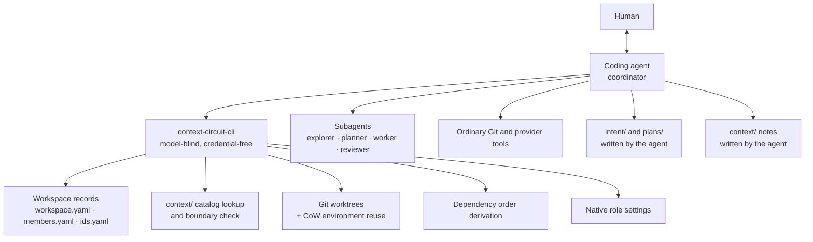

# v2.0 core — design

The normative overview of the Context Circuit v2.0 core. It states *what* the
design is and *why*; each concern's *how* lives in its own file and is linked
from here. Written against the 2.0.0-rc.1 candidate.

## The capability

A Context Circuit workspace is the durable knowledge and coordination layer for
one product across one or more Git repositories. It holds:

- the project's identity, purpose, logical repositories, default base branches,
  and the relationships between them;
- durable project knowledge — architecture, conventions, decisions, domain
  rules, vocabulary — with a catalog that routes a reader to the smallest
  relevant set of notes;
- the roster of members who share it;
- approved intents and the plans derived from them, with their progress.

Around that, v2 provides the coordination a multi-repository change needs:
worktree preparation with environment reuse, dependency-ordered execution of
stacked plans, subagent dispatch with per-host role settings, and explicit
delivery and completion.

Two products deliver it: a **workspace template** (cloned, then initialized) and
a separately released **Go CLI** (installed per execution environment, pinned
per workspace). See [versioning-and-distribution.md](./versioning-and-distribution.md).

## The problem

Every AI-assisted change to a real product needs the same four things, and every
session that does not have them pays to rediscover them:

1. **Grounding** — what is already true about this product, without re-reading
   the whole codebase.
2. **An agreed outcome** — what "correct" means for this change, decided before
   anyone is deep in code and expensive to revisit.
3. **Somewhere safe to work** — isolation that does not cost a dependency
   reinstall, across repositories that must change in a particular order.
4. **A return path** — a way for what was learned to become grounding for the
   next change rather than evaporating with the conversation.

v1 provided all four, wrapped in a trust machinery intended to make each step
provable: consequence tiers, frozen contract digests, candidate identities,
execution and verification and host-evidence records, path leases, and automatic
repair loops. The machinery's cost was paid on every increment. Its benefit
turned out to be mostly notional, because what it produced were records asserting
that the machinery had run — not evidence that the work was right.

## Principles

**P1 — Git is authoritative; the workspace is notes.** A plan note records what a
session believed when it wrote it. A branch, a diff, and a check result record
what is. On resume the diff is read first and the notes second. The instruction
says this outright: *a note is not proof of current implementation.*

**P2 — Mechanism is Go; judgment is the agent.** Anything that must happen
identically every time — ID allocation, YAML edits, binding resolution, Git
operations, order derivation — belongs in a model-blind executable. Anything
requiring interpretation belongs to the agent, in the conversation, where a
human can see it. See [executable-and-agent.md](./executable-and-agent.md).

**P3 — Never claim what has not been established.** `agent dispatch` returns
`launch_required: true`. `agent setup` writes a native role file and does not
claim the host loaded it. `record order` states that it ran, merged, and
reserved nothing. `check` is labeled a diagnostic. The release notes say that
whether a host follows the shared instruction is not established by the tests.
This is a design rule, not a disclaimer style.

**P4 — Two human decisions, and nothing simulating one.** Approving the intended
outcome, and authorizing an outward action. Consent cannot come from a command,
an editable note, or another agent. See
[authority-and-delivery.md](./authority-and-delivery.md).

**P5 — Preserve work unconditionally.** No silent force-checkout, reset, stash,
or overwrite. Failed, partial, and interrupted work survives. A failure in one
repository discards nothing in another. Completed plans are never unwound.

**P6 — Ceremony must earn its cost.** A mechanism that adds a step to every
increment must prevent a failure that would otherwise actually occur. Where it
does not, delete it and let the real artifact carry the weight. This principle
is what produced [retired-machinery.md](./retired-machinery.md).

**P7 — Knowledge outlasts the records that produced it.** A durable note may not
depend on an ephemeral one. See [knowledge-circuit.md](./knowledge-circuit.md).

## The shape of the whole



The executable never appears in the conversation. The human describes a change;
the agent interprets it, uses the CLI for bookkeeping, works in real
repositories, and reports in project language.

### One increment, end to end

```mermaid
sequenceDiagram
    participant H as Human
    participant A as Agent
    participant C as CLI
    participant G as Repositories

    H->>A: "Add recurring billing to the API and web app."
    A->>C: context find — retrieve relevant knowledge
    A->>C: record create --kind intent
    A->>H: Present goal, non-goals, criteria, scope
    H->>A: Approve
    A->>C: record approve (records the actual decision)
    A->>G: Read the real code
    A->>C: record create --kind plan (one or more, linked)
    A->>H: Present the plans, then proceed
    A->>C: record order --intent i001
    A->>H: Confirm waves or chain, once
    A->>C: worktree prepare (per plan, per repository)
    A->>A: Dispatch workers; wait; inspect real diffs
    A->>G: Run the repositories' ordinary checks
    A->>H: Report files changed, checks run, and what failed
    H->>A: "Open a PR." / "Review it." / "Mark them done."
    A->>C: record complete → candidate catalog entries
    A->>A: Reconcile the knowledge that actually changed
```

Note what is *not* in that sequence: no plan approval gate, no tier
classification, no candidate construction, no verification record, no automatic
review, and no completion inference.

## Fixed decisions

| # | Decision | Detail |
| --- | --- | --- |
| D1 | A Go executable replaces the shell runtime; native binaries for macOS, Linux, Windows on amd64/arm64, so Windows needs no WSL | [executable-and-agent.md](./executable-and-agent.md) |
| D2 | The executable is model-blind and credential-free: no LLM keys, no model calls, no application setup, no plan execution, no commit/push/merge/deploy | [executable-and-agent.md](./executable-and-agent.md) |
| D3 | The CLI is a separate product with its own version line; each workspace pins its CLI version, and versions install side by side | [versioning-and-distribution.md](./versioning-and-distribution.md) |
| D4 | Records are workspace-global with prefixed IDs (`i001`, `p0001`); `created_by` is the only member metadata | [records-and-ids.md](./records-and-ids.md) |
| D4a | An **optional** per-member allocation band divides the numeric range so separate clones allocate without colliding; unbanded is the default | [records-and-ids.md](./records-and-ids.md) |
| D5 | Intent approval is the only gate before code investigation; plans are earned by it and never separately approved | [authority-and-delivery.md](./authority-and-delivery.md) |
| D6 | A plan **may** span several repositories; the v1 one-plan-per-repository constraint is gone, while per-repository plans remain first-class | [records-and-ids.md](./records-and-ids.md) |
| D7 | A `context/` note may never name a plan, an intent, or a `sources/` file; it anchors to `repo@path/`, and `check` reports violations | [knowledge-circuit.md](./knowledge-circuit.md) |
| D8 | One note is one unwrapped catalog entry; `check` reports either half missing | [knowledge-circuit.md](./knowledge-circuit.md) |
| D9 | Explicit completion returns catalog entries scoped to the plan's repositories as candidates to judge, never a list to rewrite | [knowledge-circuit.md](./knowledge-circuit.md) |
| D10 | Worktree preparation reuses ignored `node_modules` and `.env` via filesystem CoW with copy fallback, skipping on manifest mismatch | [worktrees-and-reuse.md](./worktrees-and-reuse.md) |
| D11 | Preparation and removal never reset, force, stash, or discard without explicit authorization | [worktrees-and-reuse.md](./worktrees-and-reuse.md) |
| D12 | `record order` derives waves or a linear chain from recorded dependencies and completion, reports the cost of each, and executes nothing | [stacked-execution.md](./stacked-execution.md) |
| D13 | Confirming a stacked run authorizes worktrees, `cc/*` commits, and local integration merges — and nothing outward | [authority-and-delivery.md](./authority-and-delivery.md) |
| D14 | Four subagent roles with per-host `(model, effort)` settings defaulting to `inherit`; no model catalog ships | [roles-and-dispatch.md](./roles-and-dispatch.md) |
| D15 | `agent dispatch` returns a specification with `launch_required: true`; the skill launches through the host's own tools | [roles-and-dispatch.md](./roles-and-dispatch.md) |
| D16 | Independent review is manually requested, read-only, and never blocks a PR, delivery, or completion | [roles-and-dispatch.md](./roles-and-dispatch.md) |
| D17 | Delivery, completion, worktree removal, and branch deletion are four separate acts | [authority-and-delivery.md](./authority-and-delivery.md) |
| D18 | `check` is a diagnostic, never an admission gate | [executable-and-agent.md](./executable-and-agent.md) |
| D19 | Every date in a workspace file is ISO 8601 `YYYY-MM-DD` in UTC, in frontmatter and in prose alike | [records-and-ids.md](./records-and-ids.md) |
| D20 | v2 does not migrate a v1 workspace; `init` is for fresh workspaces only | [versioning-and-distribution.md](./versioning-and-distribution.md) |

## What is deliberately absent

Stated rather than implied, because the absence is the design:

consequence tiers · contract digests · candidate identities · path leases ·
execution records · verification records · host-evidence records · automatic
repair loops · risk-triggered review · external publication · member numeric
bands *as a requirement* · compulsory delegation · a plan approval gate ·
inferred completion ·
an acceptance harness · a model catalog · a shipped invariant registry.

Each one, with what now protects that concern, is in
[retired-machinery.md](./retired-machinery.md).

## Non-goals

- **Distributed coordination.** A file lock serializes one directory, and
  allocation bands keep banded members out of each other's numbers offline.
  Neither is a distributed allocation service: unbanded members in separate
  clones, or a clone with a stale roster, can still collide. v2 says so rather
  than claiming collision prevention it does not implement.
- **Portable environments.** CoW reuse copies local files. It does not make
  native dependencies portable across OS, architecture, Node ABI, or container.
- **Provider integration.** No automatic synchronization to an issue tracker or
  external system is part of the core. Publication is an explicitly requested
  task through whatever host tools exist.
- **Proving host behavior.** Deterministic tests establish file and Git
  behavior. Whether a coding host loads and follows the shared instruction is
  not something this design can assert, and it does not.
- **Migrating v1.** See D20.

## Honest limits

Three places where the design knowingly stops short, recorded so a reader does
not mistake silence for a claim:

1. **`shares_repository_with` is coarse.** Plan records name repositories, not
   paths, so the conflict surface reported by `record order` cannot tell
   neighbouring modules from the same file. It is a signal for choosing a shape,
   not a collision predictor.
2. **Matching dependency inputs do not prove a usable install.** Identical
   manifests, lockfiles, workspace definitions, and Node version files are
   necessary, not sufficient; the source tree is not an atomic snapshot and its
   native modules may not match the target runtime.
3. **The instruction surface is the product, and it is unverified in the way
   that matters most.** Everything the agent is asked to do lives in one
   Markdown file. Tests prove the CLI; nothing in CI proves an agent read
   `AGENTS.md` and behaved accordingly.
