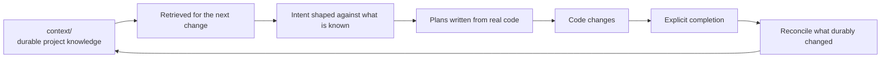

# The knowledge circuit

The part of Context Circuit that is the actual product. Everything else exists so
that this stays true.

## The circuit



Without the return path, a workspace is an execution harness with stored notes.
With it, each increment leaves the project better understood than it found it.

## Three artifact classes, deliberately separate

| Location | Meaning | How it is read |
| --- | --- | --- |
| `sources/` | Passive raw evidence | Only exact files the user or the task names; never scanned |
| `context/` | Durable accepted knowledge this workspace owns | Retrieved selectively through the catalog; edited in place |
| Mounted knowledge repositories | Durable knowledge somebody else owns | Retrieved beside the catalog; never edited here |
| `plans/`, `intent/` | What was decided and what happened | Resolved by ID; archived over time |

The separation is not filing tidiness. Each class has a different lifetime, and
mixing them is how knowledge rots — which is what the v2 boundary rules are for.

## Rule 1 — a note describes the project, not the machinery

A `context/` note may **never** name a plan record, an intent record, or a file
under `sources/`.

Two distinct failures motivate this, both observed on the v1 line:

1. **Rot.** Records are archived, renamed, and rewritten; knowledge is meant to
   outlast them. A note citing `p0007` is a dead reference the moment that plan
   is filed away, and a reader cannot tell a stale citation from a live one.
2. **Reopening passive material.** A recorded `sources/` path becomes a standing
   instruction to read evidence that is supposed to stay passive. The passivity
   rule says read only what the request names; a note that names it has
   effectively named it for every future request.

The durable anchor is a **repository path written with the logical repository
ID**, exact or patterned:

```
api@internal/billing/dunning/
web@src/features/<feature>/
```

Never a local checkout path — those are per-machine and gitignored for exactly
this reason. Links between notes are fine and encouraged. Which record or which
evidence produced a note belongs in that plan.

`check` reports any line in `context/` that crosses this boundary, by line
number, naming the match.

### Anchors live in one block

From 2.0.0-rc.11 an anchor does not go in a sentence. Every note collects its
anchors in an `Owner:` block at the end, and the body calls things by their
project names:

```
Owner:

- `api@internal/billing/dunning/` — the retry schedule and its wind-down.
- `api@internal/billing/invoice.go` `Void` — the one path that voids rather
  than credits.
```

A path dropped mid-sentence is most of what makes a note tiring to read: the
reader stops on a string they cannot act on, and the sentence grows longer to
explain why it is there. Collecting them costs one stop and puts every path
where a reader looks twice. A table pairing paths with what each one owns is the
same block by another shape, and is right wherever the mapping is the note's
subject rather than its appendix. `context/glossary.md` is the exception,
because mapping a project word to the identifier behind it is why that file
exists.

`check` reports an anchor written into a sentence — and, in the same family of
findings, a paragraph carrying a list it never made, a catalog heading that never
says what belongs under it, and a fence opened with a diagram type rather than
`mermaid`, which renders as plain text everywhere while passing every other
check. These are *readability* findings: the diagnostic reports the shape of a
note, not only its links.

## Rule 2 — one note is one unwrapped catalog entry

`context/INDEX.md` is the catalog, and an entry looks like:

```
- [Invoice lifecycle](domains/billing/invoice-lifecycle.md) {api} {web} — when an invoice is voided rather than credited · invoices, invoicing, dunning, proration · reviewed 2026-02-04
```

Five parts, each load-bearing: title and relative link; the repositories it
applies to in braces; the question it answers; the terms a reader would actually
search for; the date it was last confirmed against the code.

**The entry must be one unwrapped line.** `context find` matches whole lines by
case-insensitive substring, so a wrapped entry returns a fragment carrying no
link — a match that cannot be followed. This is a real constraint on the file
format, accepted because the retrieval mechanism is deliberately primitive:
substring matching over one small file needs no index, no embedding store, and no
service, and it degrades to "read the catalog, it is short."

Braces do real work. `{api}` cannot also match `{api-gateway}`, and a real
repository ID is always lowercase so the shipped `{REPOSITORY}` placeholder
cannot collide with one. Search terms should *separate* a note from its
neighbours; a word every entry carries narrows nothing.

**Both halves are written in the same edit.** An entry naming a note that is not
there is a confident miss; a note no entry names is reachable only by someone who
already knows its filename. `check` reports either half — a catalog entry linking
to a missing note, a catalog entry linking outside the catalog, and a note absent
from the catalog. Fenced examples in the index are skipped, since they teach the
shape rather than cataloging anything.

An absent catalog is not an error. Without one the agent falls back to targeted
filenames and search terms in `context/`.

A note lives in a directory named for its concern and is catalogued under a
heading for the same one, with one line under that heading saying what belongs
there — written before its first entry, so the next note has somewhere obvious to
go. `check` reports a heading missing that line, a directory catalogued under two
headings, and an entry claiming repositories without a reviewed date.

## Actor notes

`context/actors/` holds one note per actor that deals with the project — a person
in a role, a team, or an external system — and what each one needs from it. These
are the notes an intent is grounded against, which is why they record what an
actor needs *today* rather than what the next change will give them.

Four rules hold the shape up:

- **The flow itself is described once, in `domains/`.** An actor note carries
  only that actor's stake in it; a flow retold in every participating actor's
  note becomes several copies that disagree within a quarter.
- **Stories are numbered within their group**, restarting at 1 under each flow's
  heading, and cited by flow and number. Inserting one renumbers that group
  alone; numbering straight through would break every citation below an
  insertion at once.
- **A story says what the project does for that actor now.** A capability
  someone wants is an intent. A wish list kept here rots into a backlog nobody
  trusts, and takes the reviewed date's meaning with it.
- **Everything else is a note like any other**: anchors in `Owner:` only, and
  nothing about the workspace machinery.

An actor earns a note once the project has to ask who a request is for, or once
two actors want incompatible things from the same flow.

## Rule 3 — the glossary maps words to identifiers

`context/glossary.md` records a domain term **the first time its meaning has to be
asked for**, naming the code identifier whenever it differs from the word the
project says out loud. That mapping is the reason the file exists: a reader
searching the repositories for the business word finds nothing without it.

Design details that came from use:

- **Rows are alphabetical**, so two members adding terms from separate clones
  conflict on one row rather than on one section.
- **A meaning is one sentence.** A term needing more becomes its own note, linked
  from the catalog, with the row pointing there.
- **A word meaning different things in different repositories keeps one row per
  repository**, so the collision stays visible instead of resolving to whichever
  row was written first.
- General English, generic technology vocabulary, and this product's own
  coordination words are left out.

## Gathering

On a request to gather knowledge, the agent reads the named sources, synthesizes
durable concepts into live notes, and maintains the catalog entries — in place,
in one pass. There is no proposal sidecar, no acceptance record, and no
knowledge lifecycle. v1 had a separate acceptance step; it produced a queue of
knowledge waiting to become knowledge, which is a state nobody wants an entry to
be in.

The split with Go is the usual seam: the executable can locate catalog entries
and flag a boundary violation; only the agent can decide what a concept means.

## Reconciliation on explicit completion

Completion is where the circuit closes, and the mechanism is deliberately modest.

```mermaid
sequenceDiagram
    participant H as Human
    participant A as Agent
    participant C as CLI

    H->>A: "Mark the billing plans done."
    A->>C: record complete --id p0001 --text ...
    C->>C: Append the note; stamp completed_at
    C-->>A: Catalog entries scoped to {api} {web}
    A->>A: Judge which entries' meaning actually changed
    A->>A: Edit note + entry together; move the reviewed date
    A->>C: check
```

`record complete` returns the catalog entries whose brace-tagged repositories
intersect the plan's repositories. Four properties matter:

1. **Candidates, never a worklist.** The return is "here is what could have been
   affected", and the agent judges. Go scopes by repository because that is a
   fact it can check; meaning is not.
2. **Most completions change nothing durable, and saying so is the outcome.**
   Recording "no durable knowledge changed" in the completion note is the normal
   result, not a skipped step. A mechanism that implied every completion should
   produce an edit would produce edits.
3. **Note and entry move together, and the reviewed date advances.** A renamed or
   retired identifier is a glossary row.
4. **Several plans completed together reconcile once across the set**, not once
   per plan — the durable change is a property of the work, not of the filing.

The plan's own identifiers stay out of every note reconciled from them (Rule 1),
implementation-specific evidence stays in the plan, and `check` runs afterwards.

## When a note stops being true

Completion is one way a note comes back for judgment, and on its own it is not
enough. It only ever fires for work done through this workspace: a merge by
somebody else, a commit from before the workspace existed, or a hotfix pushed
directly reaches nothing. Through 2.0.0-rc.12 the reviewed date recorded that
gap and never closed it — `check` enforced the date's presence and never read it
back, which made it write-only and let knowledge go stale invisibly.

From 2.0.0-rc.13 `check` reads that date **against the code the note itself
points at**, through the anchors in its `Owner:` block, and reports a note with
commits under its anchors since it was last confirmed, with how many.

The comparison is against the code rather than the calendar because age is not
evidence. A note whose anchors nobody has touched is not stale however old its
date is, and reporting it would produce a list that never reaches zero and
teaches people to scroll past findings. Commits on the day of the review do not
count: a note confirmed that day was confirmed against them.

A note that anchors to no code has no evidence to read, so calendar age is all
there is for it — and it is reported only where a workspace asks:

```yaml
knowledge_review_days: 180
```

Unset, nothing is reported for those notes. The setting is shared, because how
long a fact may go unconfirmed is a project judgment rather than one machine's.

The finding is always a person's to settle: re-read the note, then edit it with
its entry, or move the date alone when nothing it says changed. Which is also
why the date moves only on an actual reading. A rewrite that changed a note's
shape and not its facts leaves the date where it is — moving it makes a stale
note look current and silences the one check that would have caught it.

## Borrowed knowledge

`context/` holds knowledge this workspace owns: it describes this project, and
completing a plan brings the notes that plan changed back for judgment. An
organization's knowledge center works the other way. It is shared by many
workspaces, it is changed through its own repository, and no plan completed here
will ever invalidate it. So from 2.0.0-rc.13 it is **mounted rather than
copied**:

```yaml
knowledge_repositories:
  core-service-knowledge:
    url: git@git.example.com:platform/core-service-knowledge.git
    default_branch: main
    index: index.md
```

Copying is the failure this prevents. A note duplicated into `context/` goes
stale silently while still reading as current, and nothing in the workspace can
tell that it has. The two moves available before this existed were that copy, or
leaving the knowledge out and letting every agent re-derive the same facts from
source and trial and error.

Four properties define the mount:

1. **Read-only is enforced, not requested.** Obtaining one disables its push
   URL, and every `knowledge sync` reasserts that, so an edit made here fails
   rather than half-succeeding. Improvements go upstream from a separate
   checkout, through that repository's own review.
2. **Sync fast-forwards or reports.** It fetches, then fast-forwards only when
   the checkout is clean and on the shared branch. It never merges, rebases,
   resets, or discards: a checkout holding local work is reported and left
   exactly as it is, because moving that work is a decision for whoever made it.
3. **It is not somewhere work happens.** It records no base branch, takes no
   worktree, and is never named by a plan or a relationship — for the same
   reason `workspace_repository` sits outside the repositories map. Both maps
   share one ID namespace so a note's anchor means one thing, and an ID already
   used on the other side is refused.
4. **It is never reconciled here.** `context find` reads borrowed indexes beside
   this workspace's catalog, marks which side each match came from, and names
   any index it could not read rather than narrowing the result in silence. But
   completion never offers a borrowed entry as knowledge to reconcile: it would
   name an obligation nobody here can discharge.

Nothing validates a borrowed repository's contents the way `check` validates
`context/`. The catalog rules exist so a person *here* can fix what they break,
and neither half of that holds for a repository this workspace does not own.

## Non-blocking by design

The circuit is intentionally not a gate. A later plan may begin even if an
earlier completion's reconciliation has not happened. Absence is visible debt,
not a hidden authorization barrier — v1 experimented with reconciliation debt
that blocked grounding, and v2 declined it: blocking new work on documentation
hygiene trains people to record that nothing changed.

The steady state the design aims at is stronger than "documentation exists":

> Every increment that changes durable project truth should leave the shared
> knowledge aligned with that new truth, so the next increment retrieves it
> instead of rediscovering it.

That is a reasoned reconciliation, not documentation generated from a diff. Code
shows what changed mechanically; only the agent can determine which consequences
are durable.
