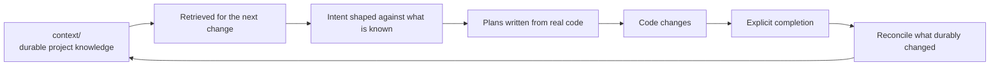

# The knowledge circuit

The part of Context Circuit that is the actual product. Everything else exists so
that this stays true.

## The circuit



Without the return path, a workspace is an execution harness with stored notes.
With it, each increment leaves the project better understood than it found it.

## Three artifact classes, deliberately separate

| Location | Meaning | How it is read |
| --- | --- | --- |
| `sources/` | Passive raw evidence | Only exact files the user or the task names; never scanned |
| `context/` | Durable accepted knowledge | Retrieved selectively through the catalog; edited in place |
| `plans/`, `intent/` | What was decided and what happened | Resolved by ID; archived over time |

The separation is not filing tidiness. Each class has a different lifetime, and
mixing them is how knowledge rots — which is what the v2 boundary rules are for.

## Rule 1 — a note describes the project, not the machinery

A `context/` note may **never** name a plan record, an intent record, or a file
under `sources/`.

Two distinct failures motivate this, both observed on the v1 line:

1. **Rot.** Records are archived, renamed, and rewritten; knowledge is meant to
   outlast them. A note citing `p0007` is a dead reference the moment that plan
   is filed away, and a reader cannot tell a stale citation from a live one.
2. **Reopening passive material.** A recorded `sources/` path becomes a standing
   instruction to read evidence that is supposed to stay passive. The passivity
   rule says read only what the request names; a note that names it has
   effectively named it for every future request.

The durable anchor is a **repository path written with the logical repository
ID**, exact or patterned:

```
api@internal/billing/dunning/
web@src/features/<feature>/
```

Never a local checkout path — those are per-machine and gitignored for exactly
this reason. Links between notes are fine and encouraged. Which record or which
evidence produced a note belongs in that plan.

`check` reports any line in `context/` that crosses this boundary, by line
number, naming the match.

## Rule 2 — one note is one unwrapped catalog entry

`context/INDEX.md` is the catalog, and an entry looks like:

```
- [Invoice lifecycle](domains/billing/invoice-lifecycle.md) {api} {web} — when an invoice is voided rather than credited · invoices, invoicing, dunning, proration · reviewed 2026-02-04
```

Five parts, each load-bearing: title and relative link; the repositories it
applies to in braces; the question it answers; the terms a reader would actually
search for; the date it was last confirmed against the code.

**The entry must be one unwrapped line.** `context find` matches whole lines by
case-insensitive substring, so a wrapped entry returns a fragment carrying no
link — a match that cannot be followed. This is a real constraint on the file
format, accepted because the retrieval mechanism is deliberately primitive:
substring matching over one small file needs no index, no embedding store, and no
service, and it degrades to "read the catalog, it is short."

Braces do real work. `{api}` cannot also match `{api-gateway}`, and a real
repository ID is always lowercase so the shipped `{REPOSITORY}` placeholder
cannot collide with one. Search terms should *separate* a note from its
neighbours; a word every entry carries narrows nothing.

**Both halves are written in the same edit.** An entry naming a note that is not
there is a confident miss; a note no entry names is reachable only by someone who
already knows its filename. `check` reports either half — a catalog entry linking
to a missing note, a catalog entry linking outside the catalog, and a note absent
from the catalog. Fenced examples in the index are skipped, since they teach the
shape rather than cataloging anything.

An absent catalog is not an error. Without one the agent falls back to targeted
filenames and search terms in `context/`.

## Rule 3 — the glossary maps words to identifiers

`context/glossary.md` records a domain term **the first time its meaning has to be
asked for**, naming the code identifier whenever it differs from the word the
project says out loud. That mapping is the reason the file exists: a reader
searching the repositories for the business word finds nothing without it.

Design details that came from use:

- **Rows are alphabetical**, so two members adding terms from separate clones
  conflict on one row rather than on one section.
- **A meaning is one sentence.** A term needing more becomes its own note, linked
  from the catalog, with the row pointing there.
- **A word meaning different things in different repositories keeps one row per
  repository**, so the collision stays visible instead of resolving to whichever
  row was written first.
- General English, generic technology vocabulary, and this product's own
  coordination words are left out.

## Gathering

On a request to gather knowledge, the agent reads the named sources, synthesizes
durable concepts into live notes, and maintains the catalog entries — in place,
in one pass. There is no proposal sidecar, no acceptance record, and no
knowledge lifecycle. v1 had a separate acceptance step; it produced a queue of
knowledge waiting to become knowledge, which is a state nobody wants an entry to
be in.

The split with Go is the usual seam: the executable can locate catalog entries
and flag a boundary violation; only the agent can decide what a concept means.

## Reconciliation on explicit completion

Completion is where the circuit closes, and the mechanism is deliberately modest.

```mermaid
sequenceDiagram
    participant H as Human
    participant A as Agent
    participant C as CLI

    H->>A: "Mark the billing plans done."
    A->>C: record complete --id p0001 --text ...
    C->>C: Append the note; stamp completed: YYYY-MM-DD
    C-->>A: Catalog entries scoped to {api} {web}
    A->>A: Judge which entries' meaning actually changed
    A->>A: Edit note + entry together; move the reviewed date
    A->>C: check
```

`record complete` returns the catalog entries whose brace-tagged repositories
intersect the plan's repositories. Four properties matter:

1. **Candidates, never a worklist.** The return is "here is what could have been
   affected", and the agent judges. Go scopes by repository because that is a
   fact it can check; meaning is not.
2. **Most completions change nothing durable, and saying so is the outcome.**
   Recording "no durable knowledge changed" in the completion note is the normal
   result, not a skipped step. A mechanism that implied every completion should
   produce an edit would produce edits.
3. **Note and entry move together, and the reviewed date advances.** A renamed or
   retired identifier is a glossary row.
4. **Several plans completed together reconcile once across the set**, not once
   per plan — the durable change is a property of the work, not of the filing.

The plan's own identifiers stay out of every note reconciled from them (Rule 1),
implementation-specific evidence stays in the plan, and `check` runs afterwards.

## Non-blocking by design

The circuit is intentionally not a gate. A later plan may begin even if an
earlier completion's reconciliation has not happened. Absence is visible debt,
not a hidden authorization barrier — v1 experimented with reconciliation debt
that blocked grounding, and v2 declined it: blocking new work on documentation
hygiene trains people to record that nothing changed.

The steady state the design aims at is stronger than "documentation exists":

> Every increment that changes durable project truth should leave the shared
> knowledge aligned with that new truth, so the next increment retrieves it
> instead of rediscovering it.

That is a reasoned reconciliation, not documentation generated from a diff. Code
shows what changed mechanically; only the agent can determine which consequences
are durable.
