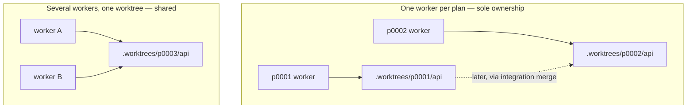

# Roles and dispatch

Four subagent shapes, settings that do not pretend to know the model landscape,
and a dispatcher that reports what it actually did.

## Roles are capabilities, not authority

| Role | Responsibility | Access |
| --- | --- | --- |
| explorer | Answer a specific codebase question with evidence | Read-only |
| planner | Investigate an approved intent and return a grounded plan | Read-only; the coordinator writes the plan |
| worker | Implement assigned work and run normal checks | Repository edits within the assigned task |
| reviewer | Independently examine a diff on user request | Read-only; no fixes, no follow-up |

The coordinator — the main session — owns task selection, preparation, waiting,
and integration. A small task may stay in the main session; delegation is a tool,
not a ritual. v1 made child agents mandatory at certain tiers; v2 does not, and
`AGENTS.md` says the optional review capability "does not make child agents
mandatory elsewhere."

The critical negative: **a role is not a risk gate.** Role settings describe
agent capability, never plan ownership, consequence, or permission to proceed.

## Role tiering without a model catalog

`.context-circuit/role-tiering.yaml` holds a concrete `(model, effort)` pair per
role and host. Every pair ships as `inherit`, meaning the host chooses its
supported defaults.

**No model catalog and no cost ladder ships.** Two reasons, both structural:

1. Any list of model names is stale within months, and a stale list embedded in a
   released template is worse than no list.
2. A hardcoded quality ordering invites silent escalation — an agent that
   "knows" model B outranks model A will upgrade, and the user will not have
   asked.

What ships instead is *reasoning the reader can apply to whatever their host
offers*, carried in the file's own comments: a planner runs once per intent and
everything downstream inherits its mistakes; a reviewer has to catch what another
model already convinced itself was fine — those two repay the strongest settings
available. A worker is where token volume goes; an explorer is high-count and
shallow. Where a host offers different model families, a reviewer drawn from a
different family than the worker has different blind spots.

Then: check what the host actually supports. Settings are a **request**, not
proof of what ran. A rejected or substituted setting is reported, never silently
downgraded.

## Native host mapping

`agent setup --host <codex|claude-code|cursor>` materializes four native role
definitions under that host's agents directory. Those files are local and
gitignored (`.codex/agents/cc-*.toml`, `.claude/agents/cc-*.md`,
`.cursor/agents/cc-*.md`); the settings that produce them are shared.

| Host | Model | Effort | Read-only |
| --- | --- | --- | --- |
| Codex | `model` | `model_reasoning_effort` | `sandbox_mode` |
| Claude Code | `model` | `effort` | Tool allowlist (Read/Glob/Grep) |
| Cursor | `model` | optional `[effort=...]` parameter | `readonly` |

For Cursor an explicit effort requires an explicit model. `inherit` omits the
override entirely. A customized native file is **preserved and reported**, never
overwritten. Because read-only roles cannot run Git, the coordinator supplies
diff text to them directly.

The honesty rule lands hard here: **writing a file is not loading it.** The host
may need a restart or reload, and neither the CLI nor the skill may claim a
definition was loaded merely because it was written.

## Dispatch

```sh
context-circuit-cli --workspace <root> --json agent dispatch \
  --host <host> --role <role> --plan <plan-id> \
  --path <actual-working-directory> --task '<bounded assignment>'
```

The CLI resolves settings and composes a brief, then returns the invocation with
**`launch_required: true`**. It has not launched anything. The `cc-dispatch`
skill calls the host's own subagent tool with the returned prompt, role, working
directory, and supported settings, waits, and integrates the result.

A dispatch specification is never evidence that an agent ran or completed (P3).

Prefer a fresh context; **always** use a fresh independent context for a
reviewer, and never reuse the implementer's session as its own reviewer.

## Two axes of parallelism

The subtlety worth the most words, because getting it backwards is expensive in
opposite directions.



**Sole ownership (default).** Separate plans get separate working copies and
branches. A worker cannot touch a sibling's files, and the sibling's work arrives
later through an integration merge. The brief tells the worker it owns the
directory.

**Shared ownership (`--shared`).** Several workers inside one plan's worktree
genuinely share files and must preserve each other's edits.

Claiming the wrong one either invites a worker to guess at edits it cannot see,
or lets it overwrite edits it can. Omit `--shared` when each worker has its own
worktree.

**`--plan`** adds the plan's repositories, dependencies, and record to the brief,
and states two facts a worker cannot otherwise know: that its dependencies' work
is **already in the branch's ancestry** and need not be reimplemented, and that a
concurrent sibling plan is **invisible** and must not be guessed at.

A worker that reports an interface it assumes a sibling may also be changing is
*supplying information, not failing*. Carry it to the integration merge rather
than stopping the run.

## Independent review

Independent verification is a **manually requested read-only code review**,
usually after PR creation and optionally after delivery as an audit.

The reviewer receives the requested diff, the exact base and head revisions,
relevant surrounding code, and the intent's success criteria. It returns
actionable findings with locations and limitations. It does not modify code,
dispatch fixes, or post external comments unless asked. Tests that change files
are implementation, not read-only review.

What v2 removed is the compulsion around it:

- it never starts during execution;
- it is never triggered by a risk classification;
- it never blocks a pull request, delivery, or completion;
- findings never trigger automatic fixes.

The user decides whether to request fixes or proceed. If independence is
unavailable, the agent explains that limitation and offers an ordinary review —
and never calls the implementing session's own inspection independent.

## Host facts are bounded evidence

Host identity, permissions, model, effort, and provider status may affect cost or
speed. They never affect authority or semantics. `--review-requested` represents
an actual user request and supplies no approval by itself; no CLI command
launches an LLM or treats a dispatch specification as evidence of completion.
