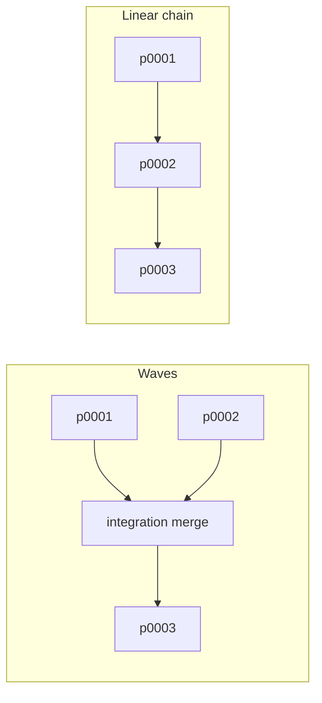

# Stacked execution

Running several plans of one intent without guessing what may run beside what.

## The problem

An intent that splits into four plans across two repositories has a shape: some
plans are independent, some depend on others, and the dependent ones need their
predecessors' work in their branch's ancestry. Before `record order`, that shape
was reconstructed by hand each time, which meant it was reconstructed wrong
occasionally and re-derived tediously always.

## Derivation, not execution

`record order` reads recorded `depends_on` links and `completed` dates and
reports:

- **waves** — each layer, its concurrency, and the plans in it;
- **start references per plan per repository** — the base, plus any merges;
- **integration points** — the merges a fan-in needs;
- **`shares_repository_with`** — which plans in one wave touch a common
  repository;
- **strategy** — repository count, fan-in count, conflict surface, the cost of
  each shape, and a recommendation with its reason;
- **completed** and **blocked** plans, and how many remain.

It **runs nothing, merges nothing, and reserves nothing.** That sentence is in
the shipped documentation because a report that looks like a plan of record
invites being treated as one (P3).

`--mode auto` reports the recommendation and follows it; `waves` and `linear`
select explicitly without changing what is recommended.

## Two shapes, with their costs

| | Wall clock | Merges | Fits |
| --- | --- | --- | --- |
| Waves | Independent plans overlap | One integration merge per fan-in | Several repositories with independent plans |
| Linear | Strictly serial | None | A single repository with any fan-in |

The recommendation is mechanical and its reasoning is reported with it:

- Parallel peak of 1 → **linear**, because "no plan runs beside another; the
  chain is the same work."
- One repository with any fan-in → **linear**, because waves buy wall clock and
  cost integration merges in the place where merges are most likely to conflict.
- Otherwise → **waves**, because independent plans in separate repositories
  overlap without an integration merge at all.

Present the recommendation **with its cost**, honor an explicit choice without
re-asking, and confirm the shape once before starting.

## The run

Confirm once, then run to completion without further prompting:

1. Prepare each worktree from the reported start.
2. Perform any reported integration merge with ordinary Git.
3. Dispatch a worker per plan; wait.
4. Integrate from **what each worker reported** — the checks it ran and their
   real outcome.
5. Read a diff where integration needs it: a merge to resolve, or a report
   naming a conflict, a failure, or an assumption. Not as a routine audit.
6. Implementation commits its own work on its `cc/*` branch before it is
   reported, which is what gives the next wave something to start from.
7. Mark a plan complete only when it **actually landed and its checks passed**.
8. **Recompute the order** before the next wave.

Step 7 is what makes step 8 work: `record order` reads completion to release the
next wave, so an unfinished plan holds its dependents automatically. There is no
separate readiness state to maintain — completion *is* the signal, which is why
it must never be recorded optimistically.

Step 8 matters because the world changed during the wave. Trusting the first
result across a whole run reintroduces exactly the staleness the derivation
exists to remove.

Steps 4 and 5 read the way they do because of a correction. The first v2 draft
said *inspect real diffs, not the workers' claims* — which is P1 applied to the
wrong thing. P1 makes Git authoritative over a **record**, a note written at one
time about work done at another. A worker's report is neither: it is a live
account of a run that just happened, naming the checks it ran and what they did.
Re-reading its diff and re-running its checks as a matter of course repeats the
expensive half of the work, which is why delegation stops paying. Failing checks
are information — report them to the person and leave the plan unmarked and
unedited rather than repairing in a loop.

Step 6 closes a failure seen in practice rather than in review: a plan prepared
beside another plan's uncommitted work was shipped without it. Since 2.0.0-rc.9
implementation commits its own work, and worktree preparation for a dependent
plan refuses rather than branching from a base that does not contain it.

## Integration merge conflicts

A conflict from an integration merge inside the run is **resolved directly**, and
the reasoning is specific: both sides are plans of the same approved intent, and
both their records and their diffs are available. The resolution preserves both
plans' behavior, then runs the repository's checks — *a resolved merge is not
trusted until they pass* — and is recorded in the plan so it can be audited.

Two cases are **not** this: a conflict against anything outside the run, and one
where preserving both sides is impossible. Both are stops.

## Stop conditions

Every one of these stops the run and preserves all work:

- failing checks after implementation, or after a resolved merge;
- a conflict outside the run, or one needing a decision;
- a worker that cannot complete or returns blocked;
- worktree preparation that refuses;
- skipped dependency reuse whose fallback setup fails;
- an order reporting a cycle, an unknown repository, or a broken link.

**Completed plans are never unwound.** The report names which plans finished,
which is stuck, and what is held behind it. A run that stops halfway is a run
that produced half its value and said so, which is strictly better than a run
that rolls back work someone can use.

## What confirming a run authorizes

Scoped, and stated at the moment of confirmation (D13):

**Authorized for that run:** worktree preparation, implementation commits on
`cc/*` branches, and local integration merges that assemble a dependent plan's
base.

**Not authorized:** push, pull request creation, merge into a base branch,
deployment, deletion.

The integration merge is the interesting case. It is a merge, and merges are
usually delivery — but this one assembles a dependent plan's starting point
inside the workspace's own `cc/*` branches. The design calls it implementation
and says so explicitly, rather than leaving an agent to reason its way to either
answer mid-run.

## The coarseness the report admits

`shares_repository_with` reflects **repositories, not paths**. Plan records name
repositories, so the conflict surface cannot tell neighbouring modules from the
same file. It is a signal for choosing a shape, not a collision predictor, and
the documentation says so rather than letting `conflict_surface: high` read as a
measurement.

Start references also name a predecessor's **branch**. Once that work is merged
and its branch is gone, the reference needs adjusting by hand — the report
derives from records, and records do not know what a provider merged.
