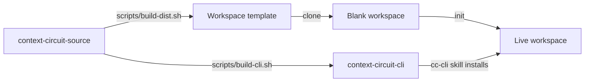

# Versioning and distribution

Two products, two release lines, and a pinning model that lets many workspaces
disagree about which CLI they want.

## Two products from one source

| | Version file | Tags | Published from | Contents |
| --- | --- | --- | --- | --- |
| Workspace template | `VERSION` | `v*` | the template repository | entry instruction, per-stage skills, docs, blank seed |
| CLI | `CLI_VERSION` | `cli-v*` | the source repository | Go binaries, six platform packages |

The two have separate release workflows and package inventories. Changing either
version file does not publish; publication is explicitly invoked.

**Why separate.** They change for different reasons and at different rates. A
wording fix in `AGENTS.md` should not force anyone to reinstall a binary; a CoW
bug fix should not force a workspace to adopt new instructions. Coupling them
would make every release the larger of the two.

## Per-workspace CLI pinning

Each workspace records the CLI version it expects in
`.context-circuit/CLI_VERSION`, and that file is **shared** — it travels with the
workspace through Git.

The mechanism that makes this work is the **version store**: versions install
side by side under `<store>/<version>-<os>-<arch>/`, and the shared
`context-circuit-cli` command on PATH is a symlink (a `.cmd` launcher on Windows)
into one of them. Installing a version for one workspace repoints the shared
command and **must not change which version another workspace runs**.

Resolution, from the `cc-cli` skill:

1. Read `.context-circuit/CLI_VERSION` in that workspace.
2. Locate the version store — the installer reports it, and it is also
   recoverable from the shared command's link target.
3. If `<store>/<version>-<os>-<arch>/context-circuit-cli` exists, run that path.
4. Otherwise install that exact version first, then run the reported versioned
   command.

When the CLI notices a mismatch it **warns on stderr and continues**, leaving
structured output on stdout untouched:

> warning: this workspace pins CLI X but Y is running; run the version this
> workspace pins, or ask the cc-cli skill to install it

The warning is framed as a caller mistake, not a workspace fault — the workspace
recorded what it wanted; something ran the wrong binary. Treat it as an
instruction to re-resolve.

CLI v2 supports **workspace schema 2**. A compatible CLI update does not change
a workspace's pin.

## Installation

The `cc-cli` skill installs and updates. Its design constraints:

- **Execution environment, not desktop.** WSL, containers, and remote Linux hosts
  use Linux packages. Each environment installs independently.
- **No administrator access.** `--bin-dir` / `-BinDir` selects a user-writable
  command directory.
- **Verified.** SHA-256 plus the executable's own reported version are checked
  *before* the command is switched to the new version. A checksum, platform,
  download, or version failure leaves the current command unchanged.
- **Rollback is reinstallation.** Old versions remain in the store.
- **Offline capable.** `--archive` / `--checksums` accept files from the same
  trusted release.
- **Bounded.** It reports a directory to add to PATH rather than rewriting shell
  profiles or unrelated host configuration. The Windows `-ExecutionPolicy Bypass`
  flag applies to the installer process only and does not change a saved policy.
- **Installation never initializes or migrates a workspace**, and an update
  retains records and the template version.

The skill also warns against a specific confusion: workspace `v*` releases are
not CLI `cli-v*` releases. Pass an exact version; do not guess that an
unpublished one exists.

## The embedded seed

The CLI embeds a blank workspace seed, used by `init` and `template export`. This
is a **convenience**, not a second source of truth:

- `template export --path NEW_DIRECTORY` writes the exact blank seed for
  inspection or packaging.
- `init` can initialize that blank seed or a fresh directory. An existing blank
  schema-2 template can be initialized independently of its template version.
- An initialized workspace is **never** automatically migrated or rewritten.
  Updates do not touch existing workspaces.

`scripts/release-manifest.txt` is the exact source-to-output mapping, `assets.go`
embeds only what the manifest names, and `check-release.sh` verifies the embedded
seed inventory against it — so the seed cannot drift from the shipped template by
accident.

## Build outputs

With no output argument each build clean-rebuilds its own directory under
`dist/` (`dist/workspace-<version>`, `dist/cli-<version>`), so repeated runs
replace rather than fail and neither build removes the other's assets. An
explicit output directory **must be new**; builds never replace existing output
there. `check-release.sh` accepts a new directory to retain both sets of checked
assets.

Native archives cover macOS, Linux, and Windows on amd64 and arm64. Release
assets include dependency licenses. Product history and maintainer data never
ship.

## Licensing

The two products carry different terms, for the same reason they carry different
version lines. The executable and this source checkout are **Apache-2.0**;
everything a workspace receives — the instruction, the skills, the docs, the
seed — is **0BSD**, which asks nothing at all of the repository it is copied
into. A workspace template that imposed a notice requirement on every repository
that adopted it would be a cost paid forever for nothing. Both were unlicensed
until 2.0.0-rc.13, which is the one answer a legal review cannot act on.

## Dependencies

Deliberately few: `goccy/go-yaml` for document-preserving YAML edits, and a
portable file-locking library for the small OS-specific locking primitive. Go
1.25+ is a contributor requirement only. **Users need the executable for their
platform and installed Git** — no Python, no Go toolchain, no YAML package
installation. Git, Node, package managers, and application services remain
separate environment dependencies.

## No v1 migration

v2 does not migrate a v1 workspace (D20). `init` is for fresh workspaces and
cannot reinitialize an active v2 one. An existing v1 workspace keeps working with
v1 and is never rewritten in place.

The alternative — a migration path — would have to translate v1's execution
records, candidates, tiers, and leases into a model that deliberately has no
place for them. Any such translation invents meaning. Running both is honest;
inventing a mapping is not.

## Candidate status

The candidate line runs through 2.0.0-rc.13 ahead of 2.0.0, each one published
for evaluation. Every candidate's release notes state the same limit directly:
deterministic tests cover file and Git behavior, the documented command surface,
and the installer on Linux, macOS, and Windows — and whether a coding host loads
and follows the shared instruction **is not established by those tests**.
Exercise the flows you rely on before depending on the release.

Records are not converted between candidates. A record written by 2.0.0-rc.3 or
earlier is refused with the rename spelled out rather than reinterpreted, and a
workspace configuration file that moved is not migrated for you. The candidates
have changed instruction shape, command surface, and configuration; what they
have not done is rewrite a workspace behind its owner.
