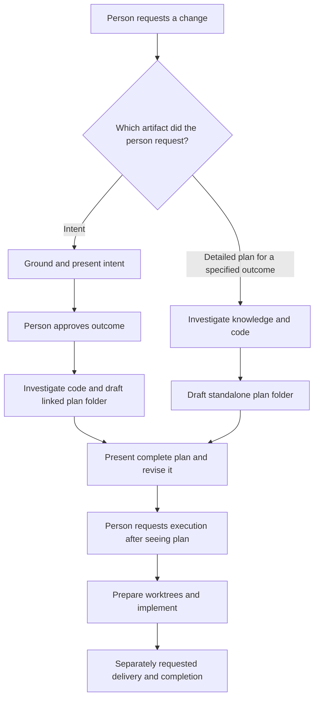

# Standalone plans and plan folders

Context Circuit v2.2.0 should let a person ask for a detailed, grounded plan
without first creating an intent. Every newly created plan should be a folder,
so its readable entry document can link to as much supporting design as the
change needs. This design targets both the workspace template and the CLI at
v2.2.0; it does not change their current version files or publish either product.

## Why this exists

An intent protects a person from approving an outcome the agent inferred from
an ambiguous request. When a developer already knows the desired outcome, they
may instead want the agent to investigate the code and produce a detailed plan
for review before implementation. Requiring an intent in that case repeats the
request and delays the artifact they actually want to inspect.

A single plan Markdown file is also a poor home for a substantial design.
Database schema, API contracts, form fields, UI structure, migration steps, and
diagrams need room to be independently readable while remaining one coherent
plan. Forcing all of them into one file makes the plan hard to navigate; making
each a separate plan invents execution and delivery boundaries that do not exist.

## Proposed model

- **Two ways to create a plan.** An intent-linked plan follows an approved
  intent. A standalone plan starts from a person's explicit request to plan a
  specified outcome and has no `intent` field. Both are grounded in relevant
  knowledge and real repository code, may name several repositories, and use
  the same plan ID, dependencies, worktree, execution, completion, and delivery
  mechanics.
- **One reviewable entry.** `plans/pNNNN-slug/plan.md` is the authoritative
  record. It carries the plan frontmatter and a concise overview, repository
  scope, approach, task order, risks, checks, and a linked contents section for
  every supporting file. Its frontmatter separates shared files from files
  required by each repository's workers. A
  small plan needs only `plan.md`.
- **Detail grows by concern.** Supporting files live inside the same folder and
  are named for what they explain, such as `api-contract.md`, `data-model.md`,
  or `ui-structure.md`. Mermaid diagrams, tables, and code examples can live in
  those files. Supporting files elaborate the plan; they do not create more
  plans, IDs, approval states, or independent completion dates.
- **The person sees the complete plan before execution.** The agent presents
  the entry and its supporting details, incorporates requested revisions, and
  waits for a subsequent execution request. For an intent-linked plan, intent
  approval still authorizes planning only. For a standalone plan, the request
  to create it authorizes investigation and drafting only. Neither request
  authorizes implementation.
- **The coordinator owns execution.** It prepares one worktree per named
  repository, gives each worker the plan body and only the supporting files
  assigned to that repository or shared by all workers, and integrates their
  reports. The CLI
  reads the `required_files` frontmatter but does not quote the whole map in
  every worker's prompt. Paths in the brief are relative to its stated
  absolute workspace root. The CLI
  prepares and reports; it does not launch workers, approve a design, or
  execute a plan.
- **Old plans stay readable.** v2.2.0 reads existing
  `plans/pNNNN-slug.md` records as they are. New plans use folders. No bulk
  migration, automatic rewrite, or inferred approval is part of the upgrade.
- **A run names its plans.** A standalone plan has no intent ID to select it
  for ordering and delivery. The CLI accepts explicit plan IDs as an
  alternative to an intent filter; it never interprets a standalone plan as
  belonging to an invented parent.

## Boundaries that remain

The CLI still owns deterministic IDs, record lookup, structural validation,
ordering, safe file edits, and Git worktree mechanics. The agent still judges
what the change means, how much detail a person needs, whether the result fits
the request, and which code and knowledge to read. The direct-change route
still means implementing in a bound checkout without a plan; asking for a
standalone plan means planning first, not silently choosing that route.

No fixed set of design documents is required. The plan folder is a container
for useful detail, not a checklist that creates empty API, database, or UI files.
Completion still records what landed and triggers knowledge reconciliation;
worktree removal remains separate.

The file and CLI implications are in [record-contract.md](record-contract.md).
The authoring, dispatch, and compatibility path is in
[workflow-and-compatibility.md](workflow-and-compatibility.md).

## Execution decision

After the complete plan is presented and revised, a separate request to
execute it authorizes implementation. There is no formal plan approval field
or approval command. The request to draft a standalone plan authorizes
investigation and planning only, and a prior instruction to implement does not
carry through an unseen plan into execution.

The execution request applies to the plan the person was shown. Before
dispatch, the coordinator reads the current entry and supporting detail again.
If a material change appeared after presentation, it presents that change
before starting work. There is no hidden approval state or automatic freeze;
the conversation supplies the decision and the current files supply the work.
