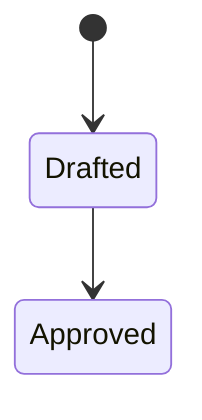

# Shared product knowledge

This optional catalog points to durable architecture, conventions, decisions,
terminology, domain rules, and repository relationships. Retrieve relevant
entries instead of scanning every note. Keep task progress in the plan records.

## Writing an entry

One note is one entry, and an entry is one unwrapped line. Retrieval matches
whole lines, so a wrapped entry returns a fragment carrying no link. The line
holds everything needed to choose the note without opening it:

```
- [Invoice lifecycle](domains/billing/invoice-lifecycle.md) {REPOSITORY} — when an invoice is voided rather than credited · invoices, invoicing, dunning, proration · reviewed 2026-02-04
```

Title and relative link, then the repositories the note applies to in braces,
then the question the note answers in a few words, then the terms a reader
would actually search for, then the date the note was last confirmed against
the code. A real entry names real repositories; the placeholder above cannot
collide with one, because a repository ID is always lowercase. Matching is
plain case-insensitive substring: a line holding `invoices` already answers a
search for `invoice`, and the braces stop `{api}` from also matching
`{api-gateway}`. Choose terms that separate a note from its neighbours, since a
word carried by every entry narrows nothing.

Group entries under headings and order them within a group. This catalog stays
small enough to read in full; searching it is the fallback once it is not. A
note absent from here is reachable only by someone who already knows its
filename, and an entry naming a note that is not there is a confident miss, so
the entry and the note are written in the same edit. The `check` diagnostic
reports either half when it is missing.

## Writing a note

A note is read by someone deciding something and by an agent about to change
code. Both want the answer first, in a shape they can scan.

Open with the title and one line saying what the note is for. Then `##`
headings, each phrased as the question that section answers. Match the form to
what is being said:

| When the content is | Write it as |
| --- | --- |
| Several things sharing attributes — states, fields, limits, options, comparisons | a table |
| A flow, a state machine, a layering, a sequence between parts | a `mermaid` diagram |
| Rules or constraints that each stand alone | bullets |
| An ordered procedure, or a chain where each step causes the next | a numbered list |
| Why it is this way, what was rejected, what breaks without it | prose, which nothing else does as well |

A diagram earns its place when the relation between things is the fact worth
recording; one that redraws the list beside it is noise. Keep to `flowchart`,
`sequenceDiagram`, and `stateDiagram`, with short labels and no styling
directives, because some readers see the source rather than a picture. More than
eight lines of unbroken prose usually has a list or a table hiding inside it.

The fence names the language and the first line inside it names the diagram
type. A fence opened with the diagram type renders as plain text everywhere, so
write it this way:



Notes, this catalog, and the glossary are written in English, whatever language
the project is discussed in. A note outlives the member who wrote it and anchors
to code, and this catalog is searched by substring, which a mixed-language index
quietly breaks. Domain vocabulary is never translated: a word the project uses
for its own subject matter keeps that word here, because the glossary maps the
project's words to the identifiers behind them and a translated term maps
nothing.

Write plainly. Lead with the answer and then the reason, keep one idea to a
paragraph, prefer the project's own words to invented synonyms, and cut any
sentence that only restates its heading. The test is whether a reader can answer
the heading's question from that section alone.

## Where a note lives

A note goes in a directory named for the concern it belongs to, and its entry
sits under a heading for that same concern, so the directory listing and this
catalog tell one story rather than two. Add a directory when a concern earns one
rather than in advance. These are a usual starting set, and this project's own
concerns are the better names wherever they differ:

| Directory | What belongs in it |
| --- | --- |
| `architecture/` | How the system is built, and why it is shaped that way |
| `domains/` | What the system does in one area of the business, the rules that govern it, and which actors take part |
| `actors/` | Who deals with this project, and what each one needs from it, as stories grouped by the flow they take part in |
| `product/` | What the product is for, who it serves, and the decisions behind it |
| `operations/` | How it is run, released, watched, and recovered |
| `references/` | Facts looked up rather than read — formats, codes, external contracts |

Every heading here carries one line saying what belongs under it, written before
its first entry, and naming the neighbouring concern where two are easily
confused:

```
### Domains

*What the system does in each area of the business, and the rules that govern
it. Who it does that for is `actors/`; how it is built is `architecture/`.*

- [Invoice lifecycle](domains/billing/invoice-lifecycle.md) {api} — when an invoice is voided rather than credited · invoices, dunning, proration · reviewed 2026-02-04
```

A heading without that line is where notes start landing by guess. The `check`
diagnostic reports a heading missing one, and a directory whose notes are
catalogued under two headings.

`INDEX.md` and `glossary.md` stay at the top level, because they describe the
whole project rather than one part of it. Everything else earns a directory. A
flat `context/` is what a project looks like before it has concerns to separate,
and it stops being readable well before this catalog does — which is the failure
this layout exists to postpone, since a reader who cannot guess where a note
lives is back to scanning.

## Durable content only

A note describes the project, not the machinery that produced it. Never name a
plan record, an intent record, or a file of raw supplied evidence. Those are
archived and rewritten while knowledge is meant to outlast them, and a recorded
evidence path becomes a standing invitation to read material that is supposed
to stay passive.

Anchor to code instead, and in one place. The body of a note calls things by
their project names — *the goodwill limit*, *the retry schedule* — and an
`Owner:` block at the end says where each one lives:

```
Owner:

- `api@internal/billing/dunning/` — the retry schedule and its wind-down.
- `api@internal/billing/invoice.go` `Void` — the one path that voids rather
  than credits.
```

An anchor carries the logical repository ID from `workspace.yaml`, exact or
patterned: `api@internal/billing/dunning/`, or `web@src/features/<feature>/`.
Never a local checkout path, because those differ from machine to machine.

A path dropped into a sentence is most of what makes a note tiring to read: the
reader stops on a string they cannot act on, and the sentence grows longer to
explain why it is there. Collecting anchors at the end costs one stop and puts
every path where a reader can find it twice. Use that heading and no other; past
a handful of paths a two-column table reads better than bullets, and both are
the same block. A run of paths separated by commas is the shape to avoid: it
reads as a string rather than a list, nothing says which path answers which
question, and a reader who cannot tell them apart opens all of them, which is
the scanning a note exists to prevent.

Where the mapping is the note's subject rather than its appendix, a table
pairing paths with what each one owns carries them instead: a column heading
does the same work the `Owner:` block does. A sentence never does.

`glossary.md` is the exception, because mapping a project word to the identifier
the code uses is the reason that file exists.

Link freely to other notes here. Which record or which evidence produced a note
belongs in that plan record. The `check` diagnostic reports any line in a note
that crosses this boundary, and any anchor written into a sentence.

## Knowledge units

*Everything this project records about itself. Groups appear here as concerns
earn them, each with its own scope line.*

- [Glossary](glossary.md) — project vocabulary and the code identifiers implementing it · glossary, terminology, vocabulary, term, jargon, naming
